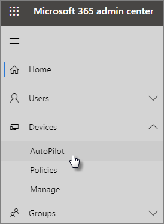

# Autopilot-eszközök és -profilok hozzáadása a lépésenkénti útmutatóvalUse the step-by-step guide to add Autopilot devices and profile

A Windows AutoPilot segítségével új **Windows** 10-es eszközöket állíthat be a vállalata számára, így azok készen állnak a használatra, amikor átadjuk őket az alkalmazottainak.You can use Windows AutoPilot to set up **new** Windows 10 devices for your business so they're ready for use when you give them to your employees.
  
## EszközkövetelményekDevice requirements

Az eszközöknek meg kell felelnie az alábbi követelményeknek:Devices must meet these requirements:
  
- Windows 10, 1703-as vagy újabb verzióWindows 10, version 1703 or later
    
- Új eszközök, amelyek még nem voltak használhatók a WindowsbanNew devices that haven't been through Windows out-of-box experience
    
## Eszközök és profilok létrehozása a beállítási útmutató használatávalUse the setup guide to create devices and profiles

Ha még nem hozott létre eszközcsoportokat vagy -profilokat, a legjobb, ha a részletes útmutatót használja.If you haven't created device groups or profiles yet, the best way to get started is by using the step-by-step guide. Az útmutató [használata](create-and-edit-autopilot-devices.md)  nélkül is felvehet eszközöket, és profilokat rendelhet hozzájuk.You can also [add devices](create-and-edit-autopilot-devices.md) and [assign profiles](create-and-edit-autopilot-profiles.md) to them without using the guide. 
  
1. A felügyeleti központ megnyitásához: <a href="https://go.microsoft.com/fwlink/p/?linkid=837890" target="_blank">https://admin.microsoft.com</a> .Go to the admin center at <a href="https://go.microsoft.com/fwlink/p/?linkid=837890" target="_blank">https://admin.microsoft.com</a>.

2. A bal oldali navigációs ablakban válassza az **Eszközök** \> **AutoPilot lehetőséget.**On the left navigation pane, choose **Devices** \> **AutoPilot**.

    
  
2. Az **AutoPilot lapon** kattintson vagy koppintson az Útmutató **kezdése elemre.**On the **AutoPilot** page, click or tap **Start guide**.
    
    
  
3. Az **Eszközlistát** is tartalmazza .csv fájl feltöltése lapon tallózással keresse meg azt a helyet, ahol előkészítette az eszközt. CSV-fájl, majd **a Következő megnyitása** \> **gombra.**On the **Upload .csv file with list of devices** page, browse to a location where you have the prepared .CSV file, then **Open** \> **Next**. A fájlnak három fejléccel kell lennie:The file must have three headers:
    
    - A oszlop: Eszköz sorozatszámaColumn A: Device Serial Number
    
    - B oszlop: Windows-termékazonosítóColumn B: Windows Product ID
    
    - C oszlop: HardverkivonatColumn C: Hardware Hash
    
    Ezeket az információkat a hardvergyártójától kaphatja meg, vagy a [Get-WindowsAutoPilotInfo PowerShell-parancsprogrammal](https://www.powershellgallery.com/packages/Get-WindowsAutoPilotInfo) létrehozhat egy CSV-fájlt.You can get this information from your hardware vendor, or you can use the [Get-WindowsAutoPilotInfo PowerShell script](https://www.powershellgallery.com/packages/Get-WindowsAutoPilotInfo) to generate a CSV file. 
    
    További információ: [Eszközlistát tartalmazó CSV-fájl](../admin/misc/device-list.md). Az **Eszközlistát tartalmazó CSV-fájl feltöltése** lapon egy mintafájlt is letölthet.For more information, see [Device list CSV-file](../admin/misc/device-list.md). You can also download a sample file on the **Upload .csv file with list of devices** page. 
    
> [!NOTE]
> Ez a parancsfájl WMI segítségével beolvassa az eszközök Windows Autopilottal való regisztrálása esetén szükséges tulajdonságokat.This script uses WMI to retrieve properties needed for a customer to register a device with Windows Autopilot. Vegye figyelembe, hogy az eredményül kapott CSV-fájlban nem kell Windows-termékazonosító (PKID) értéket gyűjteni, mivel ez nem szükséges egy eszköz regisztrálásához, és a PKID NULL érték a kimeneti CSV-fájlban teljesen rendben van.Note that it is normal for the resulting CSV file to not collect a Windows Product ID (PKID) value since this is not required to register a device and PKID being NULL in the output CSV is totally fine. A rendszer csak a sorozatszámot és a hardver kivonatát tölti ki.Only the serial number and hardware hash will be populated.
    
4. A Profil **hozzárendelése lapon** kiválaszthat egy meglévő profilt, vagy létrehozhat egy újat.On the **Assign a profile** page, you can either pick an existing profile or create a new one. Ha még nincs ilyen fiókja, a rendszer kérni fogja, hogy hozzon létre egyet.If you don't have one yet, you'll be prompted to create one. 
    
    A profil azoknak a beállításoknak a gyűjteménye, amelyek egyetlen eszközre vagy eszközök csoportjára lehet alkalmazni.A profile is a collection of settings that can be applied to a single device or to a group of devices.
    
    Az alapértelmezett funkciók kötelezők, és automatikusan vannak beállítva.The default features are required and are set automatically. Az alapértelmezett funkciók az alábbiak:The default features are:
    
    - Kihagyhatja Cortanát, a OneDrive-ot és az OEM-regisztrációt.Skip Cortana, OneDrive, and OEM registration.
    
    - Bejelentkezés céges márkával.Create sign-in experience with your company brand.
    
    - Csatlakoztassa az eszközeit az Azure Active Directory-fiókokhoz, és automatikusan regisztrálja őket a Microsoft 365 Business Premiumval való használatra.Connect your devices to Azure Active Directory accounts, and automatically enroll them to be managed by Microsoft 365 Business Premium.
    
    További információ: [Az AutoPilot-profil beállításai.](autopilot-profile-settings.md)For more information, see [About AutoPilot Profile settings](autopilot-profile-settings.md). 
    
5. A további beállítások: **Adatvédelmi beállítások kihagyása** és **Nem léptethető elő a felhasználó a helyi rendszergazdává**. Mindkettő értéke alapértelmezés szerint **Kikapcsolva**.The other settings are **Skip privacy settings** and **Don't allow user to become the local admin**. These are both set to **Off** by default. 
    
    Válassza a **Tovább** gombot.Choose **Next**.
    
6. **Ha végzett,** az azt jelenti, hogy a létrehozott (vagy kiválasztott) profilt a rendszer az eszközlista feltöltésével létrehozott eszközcsoportra alkalmazza.**You're done** indicates that the profile you created (or chose) will be applied to the device group you created by uploading the list of devices. A beállítások akkor lépnek életbe, amikor az eszköz felhasználói legközelebb bejelentkeznek.The settings will be in effect when the device users sign in next. Válassza a **Bezárás** gombot.Choose **Close**.
