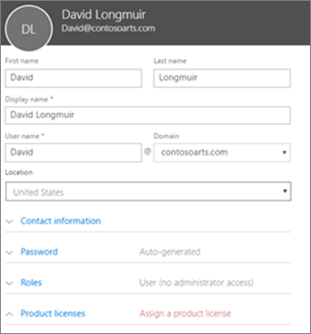
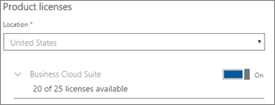

# További felhasználók hozzáadása

## Új felhasználók hozzáadása

Nézzen meg egy rövid videót a felhasználó hozzáadásáról.   

> [!VIDEO https://www.microsoft.com/videoplayer/embed/RE1FOfN] 

Ha hasznosnak találta ezt a videót, tekintse meg a [teljes tanfolyamok kisvállalatoknak és Microsoft 365-újoncoknak](https://support.office.com/article/6ab4bbcd-79cf-4000-a0bd-d42ce4d12816) című témakört.

Felhasználó hozzáadása:

1. Nyissa meg a <a href="https://go.microsoft.com/fwlink/p/?linkid=837890" target="_blank">https://admin.microsoft.com</a>felügyeleti központot a alkalmazásban. 
2. A bal oldali navigációs ablakban válassza a **Felhasználók** \> **aktív felhasználók lehetőséget.**
3. Az **Aktív felhasználók** lapon válassza **a Felhasználó hozzáadása lehetőséget.**
4. Az **Új felhasználó** panelen írja be a szükséges adatokat. 
  
    További információkat a **Kapcsolatadatai**csoportban adhat meg, megadhatja, hogyan állítsa be a jelszót a **Jelszó** beállítás csoportban, és rendeljen szerepköröket a **Szerepkörök**csoportban.
      
    
      
    A Terméklicencek szakaszban állítsa a **Microsoft 365 Business Premium** terméklicenc-beállítást **Be**beállításra.
      
    
  
A felhasználók hozzáadásáról a [Felhasználók hozzáadása egyenként vagy tömegesen](https://docs.microsoft.com/office365/admin/add-users/add-users)című témakörben talál további információt.
  
