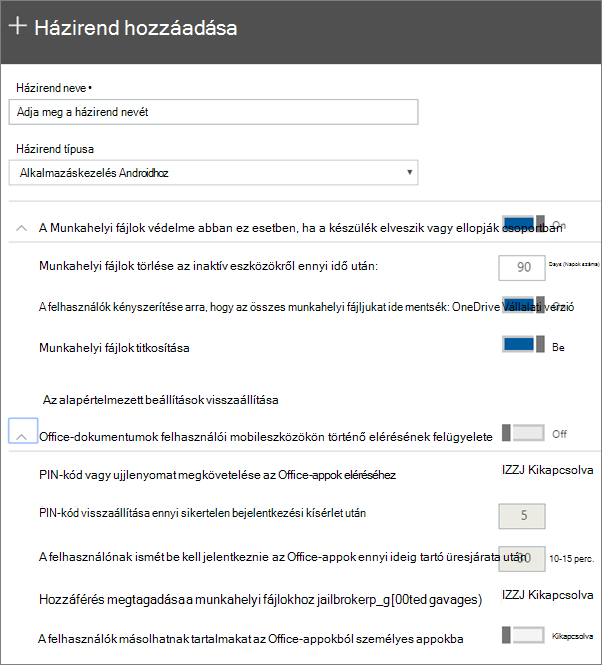

# Appvédelmi beállítások megadása androidos vagy iOS-es eszközökhöz

## Appkezelési házirend létrehozása

1. Nyissa meg a <a href="https://go.microsoft.com/fwlink/p/?linkid=837890" target="_blank">https://admin.microsoft.com</a>felügyeleti központot a alkalmazásban. 
    
2. A bal oldali navigációs sávon válassza az Eszközök \> **házirendek** \> **hozzáadása lehetőséget.** **Devices**
  
3. A **Házirend felvétele** ablaktáblában adja meg a házirend egyedi nevét. 
    
4. A **Házirend típusa csoportban**válassza **az Alkalmazáskezelés Androidhoz** vagy **az IOS alkalmazáskezelés lehetőséget**attól függően, hogy mely szabályzatokat szeretné létrehozni. 
    
5. A **Munkahelyi fájlok védelme az eszközök elvészés ellopásakor,** valamint Annak **kezelése, hogy a felhasználók hogyan férnek hozzá az Office-fájlokhoz mobileszközökön.** Adja meg a kívánt beállításokat. **Annak kezelése, hogy a felhasználók hogyan férnek hozzá az Office-fájlokhoz mobileszközökön,** alapértelmezés szerint ki van **kapcsolva,** de azt javasoljuk, hogy kapcsolja **be,** és fogadja el az alapértelmezett értékeket. További információt az [Elérhető beállítások című témakörben talál.](#available-settings) 
    
    Az **Alapértelmezett beállítások visszaállítása** hivatkozásra kattintva bármikor visszatérhet az alapértelmezett beállításokhoz. 
    
    
  
6. Next decide **Who will get these settings?** Ha nem szeretné használni az alapértelmezett **Minden felhasználó** biztonsági csoportot, válassza a **Módosítás**lehetőséget, válassza ki azokat a biztonsági csoportokat, amelyek beszerzik ezeket a beállításokat: Válassza ki a \> **Select lehetőséget.**
    
7. Végül válassza a **Kész** lehetőséget a házirend mentéséhez és eszközökhöz való hozzárendeléséhez. 
    
## Appkezelési házirend szerkesztése

1. A **Házirendek** kártyán válassza a **Házirend szerkesztése**lehetőséget.
    
2. A **Házirend szerkesztése** ablaktáblában válassza ki a módosítani kívánt házirendet. 
    
3. Válassza a **Szerkesztés** elemet az egyes beállítások mellett a házirend értékeinek módosításához. Ha módosít egy értéket, az automatikusan mentésre kerül a házirendben.
    
4. Ha végzett, zárja be a **Házirend szerkesztése** ablaktáblát. 
    
## Appkezelési házirend törlése

1. A **Házirendek** lapon válasszon egy házirendet, majd törölje a **fájlt.**
    
2. A **Házirend törlése** ablaktáblán válassza a **Megerősítés** gombot a választott házirend vagy házirendek törléséhez. 
    
## Rendelkezésre álló beállítások

Az alábbi táblázatok részletes tájékoztatást nyújtanak az eszközökön található munkahelyi fájlok védelmére rendelkezésre álló beállításokról, valamint azokról a beállításokról, amelyek azt szabályozzák, hogy a felhasználók hogyan férnek hozzá az Office-fájlokhoz a mobileszközeikről.
  
 További információt a [Microsoft 365 Vállalati prémium verzió biztonsági szolgáltatásai nak az Intune beállításaihoz való leképezése című témakörben talál.](map-protection-features-to-intune-settings.md) 
  
### Munkahelyi fájlok védelmére szolgáló beállítások

Az alábbi beállításokkal védhetők meg a munkahelyi fájlok, ha az eszköz elveszett vagy ellopták:
  
|||
|:-----|:-----|
|Beállítás    |Leírás    |
|Munkahelyi fájlok törlése az inaktív eszközökről ennyi nap után    |Ha egy eszközt nem használ az itt megadott számú napig, az eszközön tárolt munkafájlok automatikusan törlődnek.    |
|A felhasználók kényszerítése arra, hogy az összes munkahelyi fájljukat ide mentsék: OneDrive Vállalati verzió    |Ha ez a beállítás be van **kapcsolva,** a munkahelyi fájlok hoz csak a OneDrive Vállalati verzió érhető el mentési helye.    |
|Munkahelyi fájlok titkosítása    |A munkahelyi fájlok titkosítással való védelméhez ezt a beállítást tartsa **Be** állapotban. Még akkor is, ha az eszköz elveszett vagy ellopták, senki sem tudja olvasni a vállalati adatokat.    |
   
### Az Office-fájlok mobileszközökön történő elérésének felügyeletét meghatározó beállítások

Az alábbi beállítások használhatók a munkahelyi Office-fájlok elérésének kezelésére:
  
|||
|:-----|:-----|
|Beállítás    |Leírás    |
|PIN-kód vagy ujjlenyomat megkövetelése az Office-appok eléréséhez    |Ha ez a beállítás **on** a felhasználóknak meg kell adnia egy másik hitelesítési forma mellett a felhasználónevét és jelszavát, mielőtt használni Office apps a mobileszközökön.  |
|PIN-kód visszaállítása ennyi sikertelen bejelentkezési kísérlet után    |Annak érdekében, hogy ne lehessen a PIN-kódot véletlenszerű próbálkozásokkal megfejteni, az Ön által megadott számú téves próbálkozás után a PIN-kód alaphelyzetbe áll.    |
|A felhasználónak ismét be kell jelentkeznie az Office-appok ennyi ideig tartó üresjárata után    |Ez a beállítás határozza meg, hogy a felhasználó mennyi ideig lehet tétlen, mielőtt a rendszer újra bejelentkezne.    |
|Hozzáférés letiltása a munkahelyi fájlokhoz a feltört vagy rootolással feltört eszközökön    |A hozzáértő felhasználók esetleg feltört vagy rootolással feltört eszközzel is rendelkezhetnek. Ez azt jelenti, hogy a felhasználó módosíthatja az operációs rendszert, ami viszont kártevők által sebezhetőbbé teheti az eszközt. Ha ez a beállítás **Be** állapotban van, az ilyen eszközök le lesznek tiltva.    |
|Ne engedélyezze a felhasználóknak, hogy tartalmat másoljanak az Office-alkalmazásokból személyes alkalmazásokba    |Ezt alapértelmezés szerint engedélyezzük, de ha a beállítás **Be**, a felhasználó egy munkafájlban lévő adatokat személyes fájlba másolhat. Ha a beállítás ki van **kapcsolva,** a felhasználó nem tudja átmásolni az adatokat egy munkahelyi fiókból egy személyes alkalmazásba vagy személyes fiókba.    |
