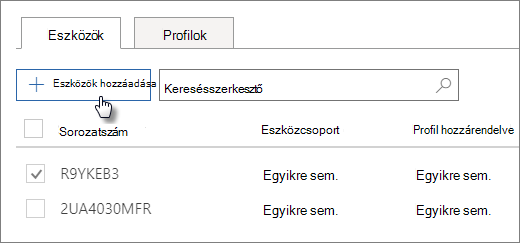

# AutoPilot-eszközök létrehozása és szerkesztése

## Eszközlista feltöltése

Az eszközök  feltöltéséhez használhatja a részletes útmutatót, de az Eszközök lapon is **feltölthet** eszközöket. 
  
Az eszközöknek meg kell felelnie az alábbi követelményeknek:
  
- Windows 10, 1703-as vagy újabb verzió
    
- Új eszközök, amelyek még nem voltak használhatók a Windowsban

1. A Microsoft 365 Felügyeleti központban válassza az **Eszközök** \> **AutoPilot lehetőséget.**
  
2. Az **AutoPilot lapon** válassza  az Eszközök lap \> **Eszközök hozzáadása lapját.**
    
    
  
3. Az Eszközök **hozzáadása panelen** tallózással keresse meg a Save Close (Bezárás mentése) eszközlista [CSV-fájlját.](../admin/misc/device-list.md) \>  \> 
    
    Ezeket az információkat a hardvergyártójától kaphatja meg, vagy a [Get-WindowsAutoPilotInfo PowerShell-parancsprogrammal](https://www.powershellgallery.com/packages/Get-WindowsAutoPilotInfo) létrehozhat egy CSV-fájlt. 
    
## Profil társítása egy eszközhöz vagy az eszközök egy csoportjához

1. A **Windows előkészítése lapon**  válassza az Eszközök lapot, és jelölje be egy vagy több eszköz jelölőnégyzetét. 
    
2. Az **Eszköz** panelen válasszon egy profilt a **Hozzárendelt profil** legördülő listából. 
    
    Ha egyetlen profilja sincs még, utasításokért olvassa el az [AutoPilot-profilok létrehozása és szerkesztése](create-and-edit-autopilot-profiles.md) című témakört. 
