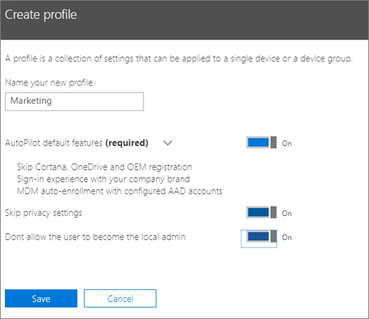
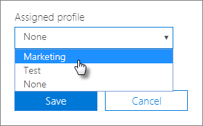

# AutoPilot-profilok létrehozása és szerkesztése

## Profil létrehozása

A profil egy eszközre vagy eszközök csoportjára vonatkozik.
  
1. A Microsoft 365 Felügyeleti központban válassza az **Eszközök** \> **Autokísérleti**lehetőséget.
  
2. Az **AutoPilot** lapon válassza **Profiles** a \> Profilok lap **Profil létrehozása**lehetőséget.
    
3. A **Profil létrehozása** lapon adja meg a profil nevét, amely segít az azonosításában, például marketing. Kapcsolja be a kívánt beállítást, majd válassza a **Mentés gombot.** Az AutoPilot profilbeállításairól az [AutoPilot-profil beállításai című témakörben](autopilot-profile-settings.md)olvashat bővebben.
    
    
  
### Profil alkalmazása eszközre

Miután létrehozott egy profilt, alkalmazhatja azt egy eszközre vagy eszközök egy csoportjára. Kiválaszthat egy meglévő profilt a [részletes útmutatóban,](add-autopilot-devices-and-profile.md) és alkalmazhatja azt új eszközökre, vagy lecserélhet egy meglévő profilt egy eszközre vagy eszközcsoportra. 
  
1. **A Windows előkészítése** lapon válassza az **Eszközök** fület. 
    
2. Jelölje be az eszköz neve melletti jelölőnégyzetet, és az **Eszköz** panelen válasszon egy profilt a **Hozzárendelt profil** \> **legördülő listából Mentés**.
    
    
  
## Profil szerkesztése, törlése vagy eltávolítása

Miután hozzárendelt egy profilt egy eszközhöz, frissítheti azt még akkor is, ha már odaadta az eszközt egy felhasználónak. Amikor az eszköz csatlakozik az internethez, a beállítási folyamat során letölti a profil legújabb verzióját. Ha a felhasználó visszaállítja az eszköz gyári alapértelmezett beállításait, az eszköz ismét le fogja tölteni a profil legújabb frissítéseit. 
  
### Profil szerkesztése

1. **A Windows előkészítése** lapon válassza a **Profilok** fület. 
    
2. Jelölje be az eszköz neve melletti jelölőnégyzetet, és a **Profil** \> panelen frissítse a **rendelkezésre**álló Mentés beállítást.
    
    Ha ezt azelőtt végzi el, hogy a felhasználó csatlakoztatná az eszközt az internetre, akkor a profilt a rendszer alkalmazza a beállítási folyamatra.
    
### Profil törlése

1. **A Windows előkészítése** lapon válassza a **Profilok** fület. 
    
2. Jelölje be az eszköz neve melletti jelölőnégyzetet, és a **Profil** panelen válassza a **Profil** \> **mentése törlése lehetőséget.**
    
    A törléssel a profilt eltávolítja arról az eszközről vagy abból az eszközcsoportból, amelyhez hozzá volt rendelve.
    
### Profil eltávolítása

1. **A Windows előkészítése** lapon válassza az **Eszközök** fület. 
    
2. Jelölje be az eszköz neve melletti jelölőnégyzetet, és az **Eszköz** panelen válassza a **Nincs** lehetőséget a **Hozzárendelt profil** legördülő \> **lista Mentés listájában.**
    
