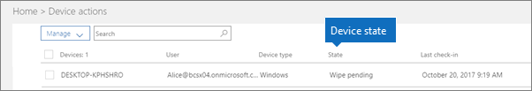

# EszközállapotokDevice states

Az **Eszközműveletek** listában (Rendszergazdai kezdőlap \> **Eszközműveletek**) szereplő eszközöknek az alábbi állapotai lehetnek.Devices in the **Device actions** list (Admin home \> **Device actions**) can have the following states.
  

  
|**Állapot****Status**|**Leírás****Description**|
|:-----|:-----|
|Kezeli az IntuneManaged by Intune    |Az eszköz a Microsoft 365 Business felügyelete alatt áll.Managed by Microsoft 365 Business.    |
|Kivezetés függőbenRetire pending    |A Microsoft 365 Business felkészülőben van a vállalati adatok eszközről való eltávolítására.Microsoft 365 Business is getting ready to remove company data from the device.    |
|Kivezetés folyamatbanRetire in progress    |A Microsoft 365 Business jelenleg a vállalati adatok eszközről való eltávolításán dolgozik.Microsoft 365 Business is currently removing company data from the device.    |
|Kivezetés sikertelenRetire failed    | A vállalati adatok eltávolításának művelete nem sikerült.Remove company data action failed.    |
|Visszavont megszüntetésRetire canceled    |A megszüntetési művelet meglett szakítva.Retire action was canceled.    |
|Törlés függőbenWipe pending    |Várakozás a gyári állapot visszaállításának megkezdésére.Waiting for factory reset to start.    |
|Törlés folyamatbanWipe in progress    |Megkezdődött a gyári állapot visszaállítása.Factory reset has been issued.    |
|Törlés sikertelenWipe failed    |Nem sikerült gyári beállítások visszaállítása.Couldn't do factory reset.    |
|Törlés megszakítvaWipe canceled    |A gyári törlőkendő törölve lett.Factory wipe was canceled.    |
|Nem kifogástalanUnhealthy    |Egy művelet függőben van (vagy folyamatban van), de az eszköz több mint 30 napig nem jelentkezett be.An action is pending (or in progress), but the device hasn't checked in for 30+ days.    |
|Törlés függőbenDelete pending    |Egy törlési művelet függőben van.Delete action is pending.    |
|ÉszleltDiscovered    |A Microsoft 365 Business észlelte az eszközt.Microsoft 365 Business has detected the device.    |
   
