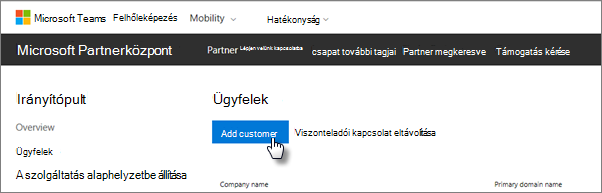
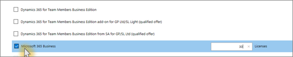

# A Microsoft 365 Vállalati prémium verzió beszerzése

## A Microsoft 365 Vállalati Prémium szolgáltatás beszereznie a Microsofttól

Ha nincs partnere, és szeretné megkapni a Microsoft 365 Business Premium-ot, [itt megvásárolhatja.](https://www.microsoft.com/en-US/microsoft-365/business)

Részletes útmutatást a [Microsoft 365 Business Premium szolgáltatásra](sign-up.md) való feliratkozás című témakörben talál.

A [Microsoft Store-ban](https://www.microsoft.com/en-us/store/locations/find-a-store?icid=en_US_Store_UH_FAS) megvásárolhatja a Microsoft 365 Business Premium áruházat, és segítséget kaphat a telepítéshez.
  
## A Microsoft 365 Vállalati prémium szolgáltatás beszereznie a Microsoft Partner Centertől

1. Jelentkezzen be a [Microsoft Partnerközpontba](https://go.microsoft.com/fwlink/p/?linkid=849910) a felhőszolgáltatói (CSP) programhoz való csatlakozáskor létrehozott hitelesítő adatokkal. 
    
2. A Partner irányítópulton válassza az **Ügyfelek**lehetőséget, majd válassza ki az ügyfelet, vagy vegyen fel új ügyfelet, mielőtt beszerezne egy Microsoft 365 Business Premium kártyát.
    
    
  
3. Az ügyfél **Előfizetés** lapján válassza az **Előfizetés hozzáadása**lehetőséget, válassza a Kisvállalati lehetőséget a Katalógus csoportban, majd válassza a **Microsoft 365 Vállalati prémium lehetőséget.**
    
    Adja meg a szükséges licencek számát (legfeljebb 300 lehet). Ha több mint 300 felhasználója van, olvassa el a [Microsoft 365 Nagyvállalati verzió](https://go.microsoft.com/fwlink/p/?linkid=862316) ismertetését. 
    
    
  
    Végezze el az új ügyfél hozzáadásának további lépéseit, beleértve a vállalkozás nevét is.
    

