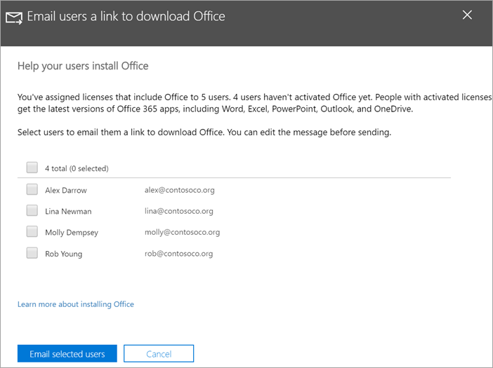

# Az Office telepítésének segít a felhasználóknak Windows 10-es eszközökön

A Microsoft 365 Felügyeleti központból gyorsan és egyszerűen telepítheti az Office-t Windows 10-es PC-re.
  
Ha meg szeretné érteni, hogy ez hogyan működik a korábban telepített Office-appokkal, olvassa el a [Felkészülés az Office-ügyfél telepítésére](prepare-for-office-client-deployment.md) című témakört.

Tekintsen meg egy rövid videót az Office-appok telepítéséről.  

> [!VIDEO https://www.microsoft.com/videoplayer/embed/acce002c-0756-4b64-ac5d-2198ee96a9b1] 

Ha hasznosnak találta ezt a videót, tekintse meg a [teljes tanfolyamok kisvállalatoknak és Microsoft 365-újoncoknak](https://support.microsoft.com/office/6ab4bbcd-79cf-4000-a0bd-d42ce4d12816) című cikket.

## Az Office üzembe helyezésének kezelése

1. A felügyeleti központ megnyitásához jelentkezzen be a globális <a href="https://go.microsoft.com/fwlink/p/?linkid=2024339" target="_blank">https://admin.microsoft.com</a> rendszergazdai hitelesítő adatokkal. 

2. A bal **oldali navigációs** ablakban válassza a Beállítás lehetőséget, majd a **Beállítás lapon** görgessen az Alkalmazások és **frissítések elemre.**
    > [!NOTE]
    > Ha az összes felhasználó telepítette az Office-appokat, előfordulhat, hogy nem látja ezt a kártyát.
  
3. A Segítség a **felhasználóknak az Office-appok** kártyája telepítéséhez csoportban válassza a **Nézet**, majd az **Első lépések lehetőséget.**
    
4. Az **Office letöltésére** mutató hivatkozás küldése a felhasználóknak panelen jelölje ki az e-mailben küldeni kívánt felhasználókat, majd válassza a Kijelölt felhasználók e-mailben **lehetőséget.**

   

## További információ a Microsoft 365 Vállalati prémium verzió beállításával és használatával

[Microsoft 365 Vállalati verzió – oktatóvideók](https://support.microsoft.com/office/6ab4bbcd-79cf-4000-a0bd-d42ce4d12816)