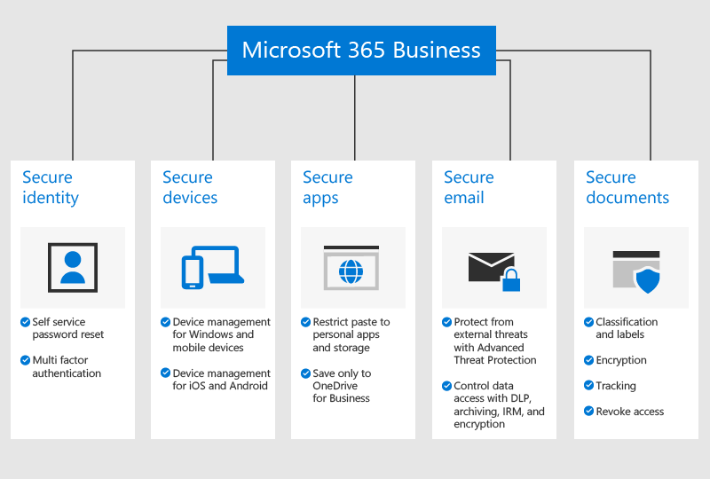

# A Microsoft 365 Vállalati prémium verzió áttekintéseOverview of Microsoft 365 Business Premium

## Mi a Microsoft 365 Vállalati prémium verzió?What is Microsoft 365 Business Premium

A Microsoft 365 Vállalati prémium verzió (korábban Microsoft 365 Vállalati verzió) egy átfogó előfizetési szolgáltatás a 300-nál kevesebb alkalmazottat foglalkoztató vállalkozásoknak.Microsoft 365 Business Premium (formerly Microsoft 365 Business) is a comprehensive subscription service for businesses with less than 300 employees. A verzió speciális biztonsági és eszközkezelési funkciókat magában foglalva integrálja a kedvenc Office hatékonyságnövelő appokat és szolgáltatásokat, valamint együttműködési eszközöket, például a Microsoft Teamst.It integrates your favorite Office productivity apps and services, and collaboration tools like Microsoft Teams, with advanced security and device management capabilities.

Ezt a videót megnézve gyorsan áttekintheti a Microsoft 365 Vállalati prémium verziót.Watch this video for a quick overview of Microsoft 365 Business Premium.  

> [!VIDEO https://www.microsoft.com/videoplayer/embed/RE2mhaA] 
  
Ha hasznosnak találta ezt a videót, tekintse meg a [teljes tanfolyamok kisvállalatoknak és Microsoft 365-újoncoknak](https://support.office.com/article/6ab4bbcd-79cf-4000-a0bd-d42ce4d12816) című cikket.If you found this video helpful, check out the [complete training series for small businesses and those new to Microsoft 365](https://support.office.com/article/6ab4bbcd-79cf-4000-a0bd-d42ce4d12816). 

A Microsoft 365 Vállalati prémium verzió legfeljebb 300 licenccel való használatra készült.Microsoft 365 Business Premium is meant for up to 300 licenses. Ha ennél több licencre van szüksége, további információért olvassa el a [Microsoft 365 Nagyvállalati verzió](https://go.microsoft.com/fwlink/p/?linkid=860986) dokumentációját.If you need more licenses, see [Microsoft 365 Enterprise](https://go.microsoft.com/fwlink/p/?linkid=860986) documentation for more information.

A funkciók teljes listáját a [Microsoft 365 Vállalati prémium verzió szolgáltatás leírásában](https://docs.microsoft.com/office365/servicedescriptions/microsoft-365-service-descriptions/microsoft-365-business-service-description) találja.See the [Microsoft 365 Business Premium service description](https://docs.microsoft.com/office365/servicedescriptions/microsoft-365-service-descriptions/microsoft-365-business-service-description) for the entire list of features.
  
## Kisvállalati biztonsági igényekSmall business security needs

Céges adatait többféle támadás is érheti.Your business data can be compromised in many ways. Ön és felhasználói megsérthetik szervezete biztonságát, ha feltört hitelesítő adatokkal jelentkeznek be, vagy különböző eszközöket és alkalmazásokat használva tekintik meg a szervezeti adatokat.You and your users can compromise your organization's security when you sign in with compromised credentials or view organization data on different devices and applications. Konkrétabban, szervezete számára veszélyt jelentenek az alábbiak:More specifically, your organization is at risk from:

- Feltört vagy gyenge bejelentkezési hitelesítő adatok.Compromised or weak sign-in credentials.
- Gyenge PIN-kóddal rendelkező feltört eszköz vagy egy felhasználó tulajdonában álló eszköz.Compromised device with a weak pin, or a user owned device.
- Azok a felhasználók, akik a szervezet adatait a személyes appjaikra másolhatják, beilleszthetik vagy menthetik.Users who can copy/paste/save your organization's data to personal apps.
- Azok a felhasználók, akik gyenge biztonsággal rendelkező külső appokat telepítenek és használnak.Users who install and use third-party apps with weak security.
- Levelezési biztonsági rések, beleértve a bizalmas adatok megosztását, az adathalászati kísérleteket, kártevőket és így tovább.Email vulnerabilities, including sharing sensitive data, phishing attempts, malware, and so on.
- Amikor illetéktelen felhasználók is hozzáférhetnek bizalmas adatokhoz.When people who should not, can access documents with sensitive information.

A Microsoft 365 Vállalati prémium verzió mindegyik példa esetében segít adatai védelmének biztosításában.Microsoft 365 Business Premium helps safeguard your data in each of these instances. A céges adatokat védő biztonsági funkciókat az alábbi ábra részletezi.The security features that protect your business data are detailed in the following figure.

## Az adatok és eszközök védelmének biztosításaHow your data and devices are protected

A Microsoft 365 Vállalati prémium verzió az alábbiakkal segíti **a fenyegetések elleni védelmet**:Microsoft 365 Business Premium helps **defended against threats** by:

- E-mailekben és dokumentumokban lévő hivatkozások beolvasása valós időben a nem biztonságos webhelyek letiltásához (Komplex veszélyforrások elleni védelem: Biztonságos hivatkozások).Scanning links in emails and documents in real time to block unsafe web sites (ATP Safe Links).

- E-mail-mellékletek speciális elemzése tesztkörnyezetben az újonnan kifejlesztett kártevők észleléséhez (Komplex veszélyforrások elleni védelem: Biztonságos mellékletek).Performing advanced analysis of email attachments in a sandbox environment to detect newly developed malware (ATP Safe Attachments). 

- Gépi tanulási modelleket és megszemélyesítés észlelését használó adathalászat elleni védelmi házirendek engedélyezése a speciális támadások elleni védelem biztosítására (Komplex veszélyforrások elleni védelem – adathalászatot megakadályozó intelligencia).Enabling anti-phishing policies that use machine learning models and impersonation detection to provide protection against advanced attacks (ATP anti-phishing intelligence). 

- Speciális házirendek beállítása, amelyek letiltják a hozzáférést a nem megbízható helyekről vagy a többtényezős hitelesítés megkerülését a megbízható helyekről, például a munkahelyi hálózatról (Azure MFA, beleértve a megbízható IP-címeket és a feltételes hozzáférést).Setting up advanced policies that disable access from untrusted locations or bypass multifactor authentication from trusted places such as your office network (Azure MFA including trusted IPs, and Conditional Access). 

- Kártevők elleni védelem kényszerítése a szervezet minden Windows 10-es eszközén és a fájlok védelme a legfontosabb rendszermappákban a zsarolóprogramok által végzett módosításoktól (Windows Defender)Enforcing malware protection across all your organization's Windows 10 devices and protecting files in key system folders from changes made by ransomware (Windows Defender)

**Üzleti adatai védelméről**az alábbiakkal gondoskodunk:Your **business data is protected** by:

- Automatikus észlelés használata a bizalmas adatok, például a társadalombiztosítási számok vagy hitelkártyák kiszivárgásának megakadályozásához (adatveszteség-megelőzés).Using automatic detection to help prevent sensitive information such as Social Security numbers or credit cards from leaking outside your business (data loss prevention). 

- A bizalmas e-mailek titkosítása az ügyfelekkel és a szervezetén kívüli személyekkel folytatott biztonságos kommunikációhoz.Encrypting sensitive emails so you can communicate securely with customers or other people outside your organization. Ez biztosítja, hogy csak a címzettek olvashassák el az üzenetet (Office 365 Üzenettitkosítás).This ensures that only the intended recipient can read the message (Office 365 Message Encryption).

- Az e-mailekre és dokumentumokra vonatkozó korlátozások, például **Lemásolni tilos** és **Nem továbbítandó** alkalmazásával szabályozhatja, hogy kinek legyen hozzáférése a céges adatokhoz (Azure Information Protection, 1. csomag).Controlling who has access to company information by applying restrictions such as **Do Not Copy** and **Do Not Forward** to email and documents (Azure Information Protection, Plan 1).

- Korlátlan felhőbeli archiválás, így szervezete összes levelezését megőrizheti, beleértve a korábbi alkalmazottak postaládáit is (Exchange Online Archiválás).Enabling unlimited cloud archiving so you can retain all your organization's email, including the mailboxes of former employees (Exchange Online Archiving).

**Eszközei védelméről**az alábbiakkal gondoskodunk:Your **devices are secured** by:

- Annak szabályozása, hogy mely eszközök és felhasználók férjenek hozzá a Microsoft-adatokhoz, valamint további beállítások annak letiltásához, hogy a felhasználók az otthoni számítógépekről, nem jóváhagyott appokról vagy munkaidőn túl jelentkezzenek be (feltételes hozzáférés).Controlling which devices and users can access your Microsoft data, with options to block users from signing in from home computers, unapproved apps, or outside of work hours (Conditional Access).

- Biztonsági házirendek alkalmazása a céges adatok védelmére iOS- és Android-eszközökön.Applying security policies to protect business data on iOS and Android devices. Megkövetelheti például a felhasználóktól, hogy a céges adatok eléréséhez PIN-kódot vagy ujjlenyomatot adjanak meg, és titkosítsák az adatokat a mobileszközökön (appvédelem Office-mobilappok esetén).For example, you can require users to provide a PIN or fingerprint to access business data, and encrypt data on mobile devices (App protection for Office mobile apps).

- A céges dokumentumok, e-mailek és egyéb adatok megőrzése jóváhagyott Office-mobilappokban, és annak megakadályozása, hogy az alkalmazottak ezeket jogosulatlan appokra és helyekre mentsék (appvédelem Office-mobilappok esetén).Keeping business documents, emails, and other data within approved Office mobile apps and preventing employees from saving these to unauthorized apps and locations (App protection for Office mobile apps).

- A céges adatok távolról történő törlése az elveszett vagy ellopott eszközökről anélkül, hogy ez érintené a személyes adatokat (Intune szelektív adattörlés).Remotely wiping business data from lost or stolen devices without affecting personal information (Intune selective wipe).

- Egyszerűsített vezérlők használata a házirendek kezeléséhez cége összes Windows 10-es PC-jén, a BitLocker titkosítás kényszerítése és a kritikus Windows-frissítések automatikus telepítése (Windows-frissítési házirendek kényszerítése).Using simplified controls to manage policies for all the Windows 10 PCs in your company, enforcing BitLocker encryption and automatically installing critical Windows updates (Enforce Windows update policies).

A biztonsági funkciók teljes listáját [a Microsoft 365 Vállalati prémium verzió biztonsági funkciói](security-features.md) leírásában találja.To see the full list of security features, see [Microsoft 365 Business Premium security features](security-features.md). Miután [beállította a Microsoft 365 Vállalati prémium verziót](set-up.md), olvassa el a [veszélyforrások elleni védelem növelése](increase-threat-protection.md) és a [megfelelőségi funkciók beállítása](set-up-compliance.md) című részeket az interaktív beállításban nem szereplő biztonsági funkciók használatbavételéhez.After you [Set up Microsoft 365 Business Premium](set-up.md), see [increase threat protection](increase-threat-protection.md) and [set up compliance features](set-up-compliance.md) to get started with the security features that aren't included as a part of the guided setup. A kiberbűnözők és támadók elleni védekezés beállítását áttekintheti [Az Office 365 és a Microsoft 365 Vállalati prémium verziós csomagok védelmének 10 legjobb módja](https://docs.microsoft.com/office365/admin/security-and-compliance/secure-your-business-data) című cikkben.Read also [Top 10 ways to secure Office 365 and Microsoft 365 Business Premium plans](https://docs.microsoft.com/office365/admin/security-and-compliance/secure-your-business-data) for a good overview on how to set up protections against cyber criminals and hackers.

## A Microsoft 365 Vállalati prémium verzió beszerzéseGet Microsoft 365 Business Premium

- Ha vannak partnerei, ők megkapják a Microsoft 365 Vállalati prémium verziót: [A Microsoft 365 Vállalati prémium verzió beszerzése a Microsoft Partnerközpontban](get-microsoft-365-business.md).If you have a partner, they'll get Microsoft 365 Business Premium: [Get Microsoft 365 Business Premium from Microsoft Partner Center](get-microsoft-365-business.md).

- Ha nincs partnere, és be szeretné szerezni a Microsoft 365 Vállalati prémium verziót, [vásárolja meg itt,](https://www.microsoft.com/microsoft-365/business) és kövesse a [regisztrációs](sign-up.md) utasításokat.If you don't have a partner and want to get Microsoft 365 Business Premium, you can [buy it here](https://www.microsoft.com/microsoft-365/business) and follow the [sign up](sign-up.md) instructions.

- Felkeresheti a [Microsoft Store](https://www.microsoft.com/en-us/store/locations/find-a-store?icid=gm_fy18_hol_bopis_feature3&CustomerIntent=Consumer) áruházat is, hogy megvásárolja a Microsoft 365 Vállalati prémium verziót, és segítséget kapjon a beállításhoz.You can also head over to a [Microsoft Store](https://www.microsoft.com/en-us/store/locations/find-a-store?icid=gm_fy18_hol_bopis_feature3&CustomerIntent=Consumer) to both buy Microsoft 365 Business Premium and get set-up help.

    > [!NOTE]
    > Ez a hivatkozás csak egyesült államokbeli áruházakra vonatkozikThis link is for stores in U.S. only

## Lásd mégSee also

[Microsoft 365 Vállalati prémium verziós oktatóvideókMicrosoft 365 Business Premium training videos](https://support.office.com/article/6ab4bbcd-79cf-4000-a0bd-d42ce4d12816)
