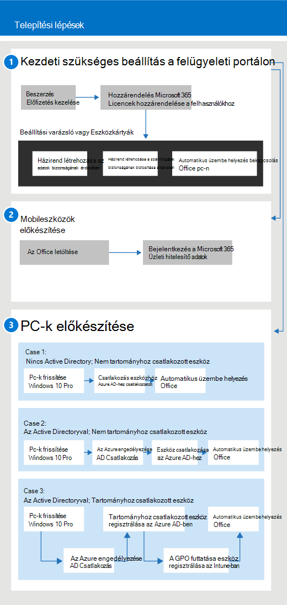

# A Microsoft 365 Business használatbavétele

## Mi a Microsoft 365 Vállalati verzió?

A Microsoft 365 Business az üzleti hatékonyság és az együttműködés olyan eszközeinek átfogó készlete, mint például az Outlook, a Word, az Excel és más Office-termékek, amelyek mindig naprakészek. A munkahelyi fájlokat minden iOS, Android és Windows 10 rendszerű eszközén megvédheti az egyszerű kezelhető nagyvállalati szintű biztonsággal.

Ebből a videóból gyorsan áttekintheti a Microsoft 365 Vállalati verziót.  

> [!VIDEO https://www.microsoft.com/videoplayer/embed/RE2mhaA] 
  
A Microsoft 365 Business legfeljebb 300 licenchez szól. Ha további licencre van szüksége, további információt a [Microsoft 365 Enterprise](https://go.microsoft.com/fwlink/p/?linkid=860986) dokumentációjában talál. 
  
## A Microsoft 365 Vállalati verzió beszerzése

- Ha van partnere, a Microsoft 365 Vállalati verzió: [A Microsoft 365 Vállalati verzió beszerezheti a Microsoft Partner Center programból.](get-microsoft-365-business.md)
    
- Ha nincs partnere, és meg szeretné vásárolni a Microsoft 365 Businesst, [itt megteheti](https://www.microsoft.com/microsoft-365/business).
    
## A Microsoft 365 Vállalati verzió beállítása

 **A Microsoft 365 Business Suite beállításának áttekintése**
  
Az alábbi ábra azt ismerteti, hogy a rendszergazdák hogyan állították be a Microsoft 365 Business t. Ezenkívül a Windows rendszerű PC-k Microsoft 365 Business használatára való előkészítésének lépéseit is tartalmazza. Új eszközöket is hozzáadhat a Microsoft 365 Vállalati felügyeleti központban a [Windows AutoPilot](add-autopilot-devices-and-profile.md)segítségével. Az AutoPilot segítségével új eszközöket állíthat be és konfigurálhat előre, hogy azok készen álljanak a hatékony használatra, amint a felhasználó bejelentkezik a Microsoft 365 Vállalati hitelesítő adataikkal.
  

Ebből a videóból megtudhatja, hogy mik a Microsoft 365 Vállalati verzió beállítása.  

> [!VIDEO https://www.microsoft.com/videoplayer/embed/RE1FYSM] 

Ha hasznosnak találta ezt a videót, tekintse meg a [teljes tanfolyamok kisvállalatoknak és Microsoft 365-újoncoknak](https://support.office.com/article/6ab4bbcd-79cf-4000-a0bd-d42ce4d12816) című témakört.

  
### 1: A Microsoft 365 Vállalati verzió beállítása (rendszergazda)

Jelentkezzen be a [Microsoft 365 Vállalati felügyeleti központba](https://portal.office.com/adminportal/home) a globális rendszergazdai hitelesítő adatokkal, és hajtsa végre az alábbi lépéseket a Microsoft 365 Vállalati verzió beállításához. 
  
1. [Az adatok védelmének előfeltételei az eszközökön a Microsoft 365 Business segítségével](pre-requisites-for-data-protection.md)
    
    Először olvassa el az előfeltételeket, és győződjön meg arról, hogy eszközei készen állnak a Microsoft 365 Business szolgáltatásra.
    
2. [A Microsoft 365 Vállalati verzió beállítása a telepítővarázslóval](set-up.md)
    
    Ha **véglegesen áthelyez egy helyi Active Directoryból a felhőbe,** lépjen a Microsoft 365 Vállalati felügyeleti központba, és a telepítővarázslóval manuálisan vegye fel a felhasználókat, vagy egyszeri szinkronizálást hajtson le az Azure AD Connectszolgáltatással. Ehhez két lehetőség közül választhat: 
    
    - Ha Exchange 2010, Exchange 2013 vagy Exchange 2016 kiszolgálóis, a [Minimal Hybrid segítségével gyorsan áttelepítheti az Exchange-postaládákat az Office 365-be.](https://support.office.com/article/fdecceed-0702-4af3-85be-f2a0013937ef) A minimális hibrid lépések közé tartozik a felhasználók egyszeri szinkronizálása az Azure AD-vel, és az e-mailek áttelepítése a helyszíni felhőbe. Az e-mailek áttelepítése után a címtár-szinkronizálás automatikusan kikapcsol, amikor ezt a módszert használja.
    
    - Az Office 365 címtárszinkronizálási varázslójával szinkronizálhatja a felhasználókat a felhővel. Ezt a [Set up directory synchronization for Office 365](https://support.office.com/article/1b3b5318-6977-42ed-b5c7-96fa74b08846) című cikk lépéseit követve végezheti el. Miután szinkronizálta a felhasználókat a felhővel, ki kell [kapcsolnia az Office 365 címtár-szinkronizálását.](https://support.office.com/article/ee5f861e-bd48-4267-83d1-a4ead4b4a00d)
    
    A Microsoft 365 Business számára licencet kell adnia minden hozzáadott felhasználónak is. Ezt megteheti a [telepítővarázslóban,](set-up.md) vagy licenceket rendelhet a [felhasználókhoz az Office 365 vállalati verzióban.](https://support.office.com/article/997596B5-4173-4627-B915-36ABAC6786DC)
    
### 2: Mobileszközök előkészítése

Kövesse a [Mobileszközök beállítása a Microsoft 365 Vállalati verzió felhasználói számára,](set-up-mobile-devices.md) hogy Office-alkalmazásokat telepítsen az eszközökre, és győződjön meg arról, hogy a Microsoft 365 Business védi őket. 
  
### 3: Pc-k előkészítése

A rendszergazdák előre kiválaszthatják az új Windows 10-es számítógépek beállításait a [Windows AutoPilot](add-autopilot-devices-and-profile.md)használatával. A felhasználók a jelen témakör lépéseivel állíthatják be meglévő vagy új Windows 10-es eszközeiket: [Windows-számítógépek beállítása a Microsoft 365 Vállalati verzió felhasználói számára.](set-up-windows-devices.md) Meglévő eszközök esetén a felhasználók **tetszés szerint** [áthelyezhetnek fájlokat a OneDrive Vállalati verzióba.](move-files-to-onedrive.md) Külső gyártótól származó eszközökkel is áthelyezhetik a Windows-profilhoz társított fájlokat a OneDrive-ra.
  
Ha szervezete a helyszínen használja a Windows Server Active Directoryt, beállíthatja a Microsoft 365 Business alkalmazást a Windows 10-es eszközök védelmére, miközben továbbra is hozzáférhet a helyi hitelesítést igénylő helyszíni erőforrásokhoz. Kövesse a [Microsoft 365 Business által felügyelt tartományhoz csatlakozó Windows 10-eszközök engedélyezése](manage-windows-devices.md) című részt. Ez a módszer ajánlott, és az ebben az állapotban lévő eszközöket **hibrid Azure AD-csatlakozású eszközöknek**nevezzük. 
  
Ha megtart egy helyi Active Directoryt, amely tartalmaz néhány helyszíni erőforrást (például fájlmegosztásokat és nyomtatókat), az **Azure AD-hez csatlakozott eszközeinek** hozzáférést biztosíthat ezekhez az erőforrásokhoz az alábbi lépéseket követve: [Helyszíni erőforrások elérése egy Azure AD-hez csatlakozó eszközről a Microsoft 365 Business](access-resources.md)programban.
  
  
## Ügyfélszolgálat

 **Ha kapcsolatba szeretne lépni az ügyfélszolgálattal:**
  
- Forduljon a partneréhez.
    
- Microsoft 365 Vállalati verzió rendszergazdájaként hozzáférhet ügyfélszolgálati csapatunkhoz: Lépjen kapcsolatba az ** [üzleti termékek ügyfélszolgálatával – Rendszergazdai súgó](https://support.office.com/article/32a17ca7-6fa0-4870-8a8d-e25ba4ccfd4b)**
    
## Lásd még

[A Microsoft 365 Vállalati verzióval kapcsolatos dokumentáció és források](https://go.microsoft.com/fwlink/p/?linkid=853701)
  
[A Microsoft 365 Vállalati verzió kezelése](manage.md)[Áttelepítés a Microsoft 365 Vállalati verzióba](migrate-to-microsoft-365-business.md)

[Microsoft 365 Vállalati verziós oktatóvideók](https://support.office.com/article/6ab4bbcd-79cf-4000-a0bd-d42ce4d12816) 
