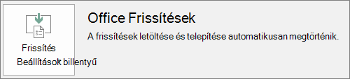

# Felkészülés Office-ügyfél központi telepítésére a Microsoft 365 Business segítségévelPrepare for Office client deployment by Microsoft 365 Business

## Felkészülés az Office-appok ügyfélszámítógépekre történő automatikus telepítésérePrepare to automatically install Office apps to client computers

A Microsoft 365 Vállalati verzió segítségével automatikusan telepítheti a 32 bites Office-alkalmazásokat Windows 10-es számítógépekre, és naprakészen tarthatja őket a frissítésekkel.You can use Microsoft 365 Business to automatically install the 32-bit Office apps on Windows 10 computers and keep them current with updates.
  
Az automatikus telepítés akkor működik a legjobban, ha a végfelhasználó számítógépe Windows 10 Business rendszeren van, és:Automatic installation works best if the end user's computer is on Windows 10 Business and:
  
- Nincsenek telepített asztali Office-appjai (Word, Excel, PowerPoint, Outlook, OneNote, Publisher, Access és OneDrive).Doesn't have existing Office desktop apps (Word, Excel, PowerPoint, Outlook, OneNote, Publisher, Access, and OneDrive).
    
    vagyor
    
- Telepítve van egy Office Kattintásra verzió.Has an existing version of Click-to-Run Office installed.
    
Ha ki szeretné deríteni, hogy az Office Office Kattintásra verziójával rendelkezik-e, egy tetszőleges Office-appban válassza a **Fájl** \> **Fiók** (az Outlookban **Office-fiók**) lehetőséget).To determine if you have the Click-to-Run version of Office, in any Office app go to **File** \> **Account** ( **Office Account** in Outlook). Ha az **Office-frissítések** az alábbi ábrán látható módon jelenik meg, akkor a telepítés a Kattintásra szolgáltatás sal történt.If you see **Office Updates** as shown in the following figure, then the installation was done by using Click-to-Run. 
  

  
 **Kinek származik előnye ennek a funkciónak a birtoklásából?****Who benefits from having this feature**
  
Annak a végfelhasználónak, akinek a PC-jén:The end user whose PC:
  
- **Megtalálható** egy Windows 10 Business verzióhoz való felhasználói licenc, egy aktív Microsoft 365 Business-licenc és a Windows 10 alkotói frissítés, illetve akinek a PC-je csatlakoztatva van az Azure Active Directoryhoz.**Has**  a Windows 10 Business user license, an active Microsoft 365 Business license, Windows 10 Creators Update, and is joined to Azure Active Directory. 
    
- **Nincs** 64 bites Office-alkalmazás (például Word, Excel, PowerPoint).**Doesn't have** 64-bit Office apps (example: Word, Excel, PowerPoint). Ha 64 bites Office-alkalmazásokra van szükség, akkor ez a funkció nem megfelelő, mert nem támogatja az Office 64 bites, kattintásra futó verziójának aktiválását a Microsoft 365 Vállalati verzió felügyeleti konzoljáról.If 64-bit Office apps are required, then this feature isn't a good fit because there's no support for triggering a 64-bit 2016 Click-to-Run version of Office from the Microsoft 365 Business admin console. 
    
- **Nem található meg** egy Windows Installer (MSI) technológiával telepített különálló 2016-os app sem (például Visio vagy Project).**Doesn't have** any 2016 Windows Installer (MSI) standalone apps (for example, Visio or Project). A Microsoft 365 Vállalati verzió az Office-t az Office 2016 Office Kattintásra verziójára frissíti, és ez nem működik az Office 2016-os MSI önálló alkalmazásokkal.Microsoft 365 Business upgrades Office to the Click-to-Run version of Office 2016 and that doesn't work with Office 2016 MSI standalone apps. 
    
Az alábbi táblázat bemutatja, hogy a végfelhasználóknak/rendszergazdáknak milyen lépéseket kell tenniük a kezdeti állapotuktól függően ahhoz, hogy az Office központi telepítésének sikeres 32 bites Office-telepítést a Microsoft 365 Vállalati verzió felügyeleti konzoljáról történő futtatásához.The following table shows what action the end users/admins may need to take, depending on their beginning state, to have a successful 32-bit Click-to-Run version of Office deployment from the Microsoft 365 Business admin console.
  
|**Az Office telepítésének kezdő állapota****Starting Office install status**|**Az Office Microsoft 365 Business-szel való telepítése előtt szükséges művelet****Action to take before Microsoft 365 Business Office install**|**Záró állapot****End state**|
|:-----|:-----|:-----|
|Nincs telepítve Office programcsomagNo Office suite installed    |Egyikre sem.None    |Az Office 2016 32 bites telepítése kattintásraOffice 2016 32-bit is installed by using Click-to-Run    |
|Az Office Kattintásra technológiával telepített Office 32 bites verziója (2016-os vagy korábbi verzió), különálló appok nélkülExisting Click-to-Run 32-bit version of Office (2016 or earlier) and no standalone apps    |Egyikre sem.None    |Frissítve az Office 2016 legújabb 32 bites, Office Kattintásra verziójára, szükség szerint **\***Upgraded to the latest 32-bit Click-to-Run version of Office 2016, as needed **\***   |
|Az Office és a Kattintásra 32 bites vagy a 64 bites önálló Office-alkalmazások (például Visio, Project) meglévő, Kattintásra 32 bites verziójaExisting Click-to-Run 32-bit version of Office and Click-to-Run 32-bit or 64-bit standalone Office apps (for example, Visio, Project)    |Egyikre sem.None    |Az önálló alkalmazásokat ez nem érinti.Standalone apps aren't affected. A programcsomag frissül az Office Kattintásra technológiával telepített Office 2016 32 bites verziójáraSuite is upgraded to Click-to-Run 32-bit version of Office 2016    |
|Az Office Kattintásra technológiával telepített Office 32 bites verziója és bármely 32 vagy 64 bites (a 2016-os verzió kivételével), MSI technológiával telepített különálló Office-appExisting Click-to-Run 32-bit version of Office and any 32-bit or 64-bit (except 2016) MSI standalone Office apps    |Egyikre sem.None    |Az önálló alkalmazásokat ez nem érinti.Standalone apps aren't affected. A programcsomag frissül az Office Kattintásra technológiával telepített Office 2016 32 bites verziójáraSuite is upgraded to Click-to-Run 32-bit version of Office 2016    ||||
|Az Office Kattintásra technológiával telepített Office bármely meglévő, 64 bites verziójaAny existing Click-to-Run 64-bit version of Office    |Távolítsa el a 64 bites Office-alkalmazásokat, ha nem baj, ha 32 bites Office-appokra cseréli őketUninstall the 64-bit Office apps, if it's OK to replace them with 32-bit Office apps    |Ha eltávolítja a 64 bites Office-appokat, az Office Kattintásra technológiával telepített Office 2016 32 bites verziója települIf Office 64-bit apps are removed, the Click-to-Run 32-bit version of Office 2016 is installed    |
|Az Office 2016 meglévő, MSI technológiával telepített példánya különálló appokkal vagy anélkülAn existing MSI install of Office 2016 with or without standalone apps    |Az MSI technológiával telepített Office 2016 eltávolításaUninstall MSI Office 2016.    |Telepítve van az Office Kattintásra technológiával telepített Office 2016 32 bites verziója. A különálló appokat nem érinti semmilyen változás.Click-to-Run 32-bit version of Office 2016 is installed. No change to standalone apps    |
|Az Office 2013 és/vagy különálló Office-appok meglévő, MSI technológiával telepített példányaExisting MSI install of Office 2013 (or earlier) and/or standalone Office apps    |NincsNone    |Az Office Kattintásra technológiával telepített Office 2016 32 bites verziója, amely együtt létezik a korábbról meglévő, MSI technológiával telepített Office-példánnyal (és különálló appokkal)Click-to-Run 32-bit version of Office 2016 with the pre-existing MSI Office install (and standalone apps) exist side-by-side    |
||||
   
 **(\*) Megjegyzés:** Egy ismert hiba miatt nem történik meg az Office Kattintásra technológiával telepített Office 2016 32 bites verziójára való frissítés.**(\*) Note:** Does not upgrade to Click-to-Run 32-bit version of Office 2016 due to a known bug. A javítás folyamatban van.A fix is in progress. 
  
