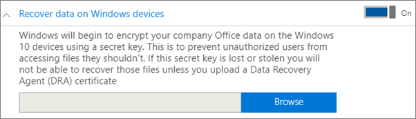
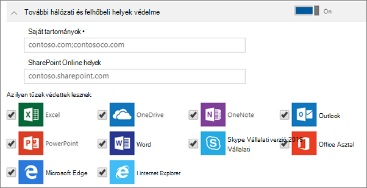

# Alkalmazásvédelmi beállítások megadása és szerkesztése Windows 10-es eszközökön

Ez a cikk a Microsoft 365 Vállalati prémium verzióra vonatkozik.

## Alkalmazáskezelési házirend szerkesztése Windows 10-ben

1. A felügyeleti központ megnyitásához: <a href="https://go.microsoft.com/fwlink/p/?linkid=837890" target="_blank">https://admin.microsoft.com</a> .     
2. A bal oldali navigációs sávon válassza az **Eszköz-házirendek** \> **lehetőséget.**
1. Válasszon ki egy meglévő Windows-alkalmazás-házirendet, majd **szerkessze.**
1. Válassza **a Módosítani** kívánt beállítás melletti Szerkesztés gombot, majd a Mentés **gombot.**

## Appkezelési házirend létrehozása Windows 10-es eszközhöz

Ha a felhasználók munkahelyi feladatokra is használják saját Windows 10-es eszközeiket, az azokon tárolt munkahelyi adatok is védhetők.
  
1. A felügyeleti központ megnyitásához: <a href="https://go.microsoft.com/fwlink/p/?linkid=837890" target="_blank">https://admin.microsoft.com</a> . 
2. A bal oldali navigációs sávon válassza az **Eszköz-házirendek** \> **hozzáadása** \> **lehetőséget.**
3. A **Házirend felvétele** ablaktáblában adja meg a házirend egyedi nevét. 
4. A **Házirend típusa** beállításnál válassza az **Alkalmazáskezelés Windows 10-es eszközökhöz** lehetőséget.
5. Az **Eszköz típusa alatt válassza** a Személyes **vagy** a **Vállalati tulajdonú lehetőséget.**
6. A **Munkahelyi fájlok titkosítása** lehetőség automatikusan be van kapcsolva. 
7. Ha nem szeretné, hogy a felhasználók a saját számítógépükre mentsék a munkahelyi fájlokat, állítsa **A felhasználók nem másolhatnak céges adatokat saját fájljaikba, a munkahelyi fájlokat pedig csak a OneDrive Vállalati verzióba menthetik** beállítást **Be** értékre. 
9. **Bontsa ki az Adatok helyreállítása adatokat Windows-eszközökön.** Azt javasoljuk, hogy kapcsolja **be.**
    Ahhoz, hogy megkereshesse az adat-helyreállítási megbízott tanúsítványának helyét, először létre kell hoznia egyet. Az utasításokért olvassa el a Titkosított fájlrendszer (EFS) adat-helyreállítási [megbízottja (DRA)](https://go.microsoft.com/fwlink/p/?linkid=853700)tanúsítvány létrehozása és ellenőrzése.
    
    A munkahelyi fájlok alapértelmezés szerint egy az eszközön tárolt és a felhasználó profiljához társított titkos kulccsal vannak titkosítva. Csak a felhasználó tudja megnyitni és visszafejteni a fájlt. Így tehát, ha valaki elveszít egy eszközt, vagy törölnek egy felhasználót, egy szükséges fájl titkosított állapotban ragadhat. A rendszergazda az adat-helyreállítási megbízott tanúsítványával visszafejtheti a fájlt.
    
    
  
10. Bontsa ki a További hálózati és **felhőbeli** helyek védelme lehetőséget, ha további tartományokat vagy SharePoint Online-helyeket szeretne felvenni, hogy a felsorolt appokban lévő fájlok védettek-e. Ha bármelyik mezőben egynél több elemet kell megadnia, pontosvesszővel (;) válassza el őket egymástól.
    
    
  
11. Next decide **Who will get these settings?** If you don't want to use the default **All Users** security group, choose **Change**, choose the security groups who will get these settings \> **Select**.
12. Végül válassza a **Hozzáadás** lehetőséget a házirend mentéséhez és eszközökhöz való hozzárendeléséhez. 
