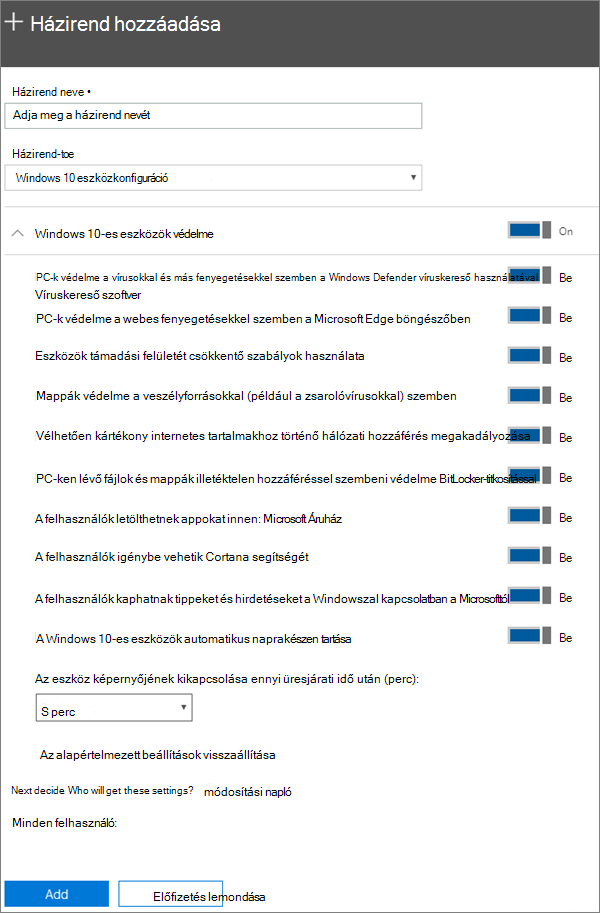

# Eszközvédelmi beállítások megadása Windows 10-es PC-khez

## Windows 10-es eszközök védelme

Tekintse meg a Windows 10-eszközök microsoft 365 vállalati verzióval való védelméről szóló videót:
  
> [!VIDEO https://www.microsoft.com/videoplayer/embed/a5734146-620a-4cec-8618-536b3ca37972?autoplay=false]
  
1. Nyissa meg a <a href="https://go.microsoft.com/fwlink/p/?linkid=837890" target="_blank">https://admin.microsoft.com</a>felügyeleti központot a alkalmazásban. 
    
2. A bal oldali navigációs sávon válassza az \> **Eszközházirendek** \> **hozzáadása lehetőséget.** **Devices**
  
3. A **Házirend felvétele** ablaktáblában adja meg a házirend egyedi nevét. 
    
4. A **Házirend típusa** csoportban válassza a **Windows 10-es eszközök konfigurálása** lehetőséget.
    
5. Expand **Secure Windows 10 Devices** \> configure the settings how you would like. További információt az [Elérhető beállítások című témakörben talál.](#available-settings) 
    
    Az **Alapértelmezett beállítások visszaállítása** hivatkozásra kattintva bármikor visszatérhet az alapértelmezett beállításokhoz. 
    
    
  
6. Next decide **Who will get these settings?** If you don't want to use the default **All users** security group, Choose **Change**, search for the security group who will get these settings \> **Select**.
    
7. Végül válassza a **Kész** lehetőséget a házirend mentéséhez és eszközökhöz való hozzárendeléséhez. 
    
## Rendelkezésre álló beállítások

Alapértelmezés szerint minden beállítás **be van kapcsolva**. Az alábbi beállítások érhetők el.
  
További információt a [Microsoft 365 Premium szolgáltatás védelmi szolgáltatásai nak az Intune beállításaihoz című témakörben talál.](map-protection-features-to-intune-settings.md) 
  
|||
|:-----|:-----|
|Beállítás    |Leírás    |
|PC-k védelme a vírusokkal és más fenyegetésekkel szemben a Windows Defender víruskereső használatával    |Használatához a Windows Defender víruskeresőnek bekapcsolt állapotban kell lennie, hogy a PC-ket védeni lehessen az internetes kapcsolat során előforduló fenyegetésekkel szemben.    |
|PC-k védelme a webes fenyegetésekkel szemben a Microsoft Edge böngészőben    |Bekapcsolja a Microsoft Edge böngészőben azokat a beállításokat, amelyek segítenek megvédeni a felhasználót a kártékony webhelyek és letöltések által okozott veszélyektől.    |
|Eszközök támadási felületét csökkentő szabályok használata    |A támadásifelület-csökkentés bekapcsolásával letilthatók azok a műveletek és appok, amelyekkel a kártevők rendszerint megfertőzik az eszközöket. Ez a beállítás csak akkor használható, ha be van kapcsolva a Windows Defender víruskereső. További információ a [támadásifelület-csökkentésről](https://docs.microsoft.com/windows/security/threat-protection/microsoft-defender-atp/exploit-protection).    |
|Mappák védelme a veszélyforrásokkal (például a zsarolóvírusokkal) szemben    |Ez a beállítás ellenőrzött mappahozzáférést használ, hogy megvédje a vállalati adatokat a gyanús vagy rosszindulatú alkalmazások, például zsarolóprogramok általi módosításokkal szemben. Az ilyen típusú alkalmazások nem módosíthatják a védett mappákat. Ez a beállítás csak akkor használható, ha be van kapcsolva a Windows Defender víruskereső. További [információ: Mappák védelme ellenőrzött mappákkal.](https://docs.microsoft.com/configmgr/protect/deploy-use/create-deploy-exploit-guard-policy#bkmk_CFA)    |
|Vélhetően kártékony internetes tartalmakhoz történő hálózati hozzáférés megakadályozása    |Ezzel a beállítással letilthatja a kimenő felhasználói kapcsolatokat az alacsony hírnévvel rendelkező internetes helyekre, amelyek adathalász csalásokat, biztonsági réseket vagy más rosszindulatú tartalmat tartalmazhatnak. Ez a beállítás csak akkor érhető **On**el, ha a Windows Defender víruskereső be van kapcsolva. További információt [a Hálózat védelme](https://docs.microsoft.com/windows/security/threat-protection/windows-defender-antivirus/configure-real-time-protection-windows-defender-antivirus)című témakörben talál.    |
|PC-ken lévő fájlok és mappák illetéktelen hozzáféréssel szembeni védelme BitLocker-titkosítással    |A Bitlocker a számítógép merevlemezének titkosításával és a számítógép elvesztése vagy ellopása esetén az adatok kinyerése elleni védelemmel biztosítja adatai védelmét. További információ: [Bitlocker GYIK](https://go.microsoft.com/fwlink/?linkid=871000).    |
|A felhasználók letölthetnek appokat innen: Microsoft Áruház    |Lehetővé teszi, hogy a felhasználók appokat tölthessenek le és telepíthessenek a Microsoft Áruházból. Az appok között játékok és munkára használható eszközök egyaránt lehetnek, ezért ez a beállítás **Be** állapotban van, de a fokozott biztonság érdekében ki is kapcsolhatja.    |
|A felhasználók igénybe vehetik Cortana segítségét    |Cortana nagyon hasznos lehet. Cortana be- és kikapcsolhatja a beállításokat, útbaigazítást adhat, és meggyőződhet arról, hogy időben van a találkozókhoz, ezért alapértelmezés szerint **bekapcsolva** tartjuk ezt a beállítást.    |
|A felhasználók kaphatnak tippeket és hirdetéseket a Windowszal kapcsolatban a Microsofttól    |A Windows-tippek hasznosak lehetnek, és új funkciók megjelenésekor segíthetnek a felhasználóknak a funkciók megismerésében.    |
|A Windows 10-es eszközök automatikus naprakészen tartása    |Biztosítja, hogy a Windows 10-es eszközök automatikusan megkapják a legújabb frissítéseket.    |
|Az eszköz képernyőjének kikapcsolása ennyi üresjárati idő után    |Biztosítja a céges adatok védelmét, amikor a felhasználó inaktív. Előfordulhat, hogy a felhasználó nyilvános helyen, például egy kávézóban végez munkát, és ilyenkor ha csak rövid időre is elvonják a figyelmét az eszközről, akkor annak kijelzőjét illetéktelen személyek is láthatják. Ezzel a beállítással azt határozhatja meg, hogy a felhasználó mennyi ideig maradhat inaktív, mielőtt az eszköz kijelzője kikapcsol.    |
