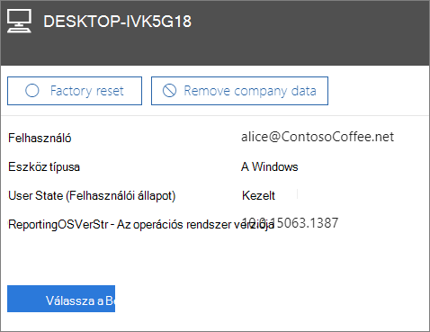

# Céges adatok eltávolítása az eszközökrőlRemove company data from devices

Ez a cikk a Microsoft 365 Vállalati prémium verzióra vonatkozik.This article applies to Microsoft 365 Business Premium.

## Céges adatok eltávolításaRemove company data

A Microsoft 365 Vállalati verzióval eltávolíthatja a felhasználók  eszközein vagy [a Microsoft](protection-settings-for-windows-10-devices.md) 365 által védett Windows rendszerű PC-ken elérhető vállalati adatokat.You can use Microsoft 365 for business to remove company data that your users have on their [devices](app-protection-settings-for-android-and-ios.md) or [Windows PCs](protection-settings-for-windows-10-devices.md) that are protected by Microsoft 365. **Az eszközökről eltávolított céges adatok később nem állíthatók vissza**.**If you remove company data from a device, you cannot restore it later**. 
  
1. A felügyeleti központ megnyitásához: <a href="https://go.microsoft.com/fwlink/p/?linkid=837890" target="_blank">https://admin.microsoft.com</a> .Go to the admin center at <a href="https://go.microsoft.com/fwlink/p/?linkid=837890" target="_blank">https://admin.microsoft.com</a>.
    
2. A bal oldali navigációs sávon válassza az **Eszközök** \> **kezelése lehetőséget.**  On the left nav, choose **Devices**  \> **Manage**.
  
3. A Kezelés **lapon** válassza ki vagy keresse meg azt a felhasználót, akinek az adatait el szeretné távolítani, és válassza ki a nevet.On the **Manage** page, choose or search for a user who's data you want to remove, and choose the name. 
    
4. A következő ablaktáblán válassza ki az eszközt vagy eszközöket az Eszközök **listából.**On the next pane, select the device or devices from the **Devices** list. A megnyíló eszközpanelen az eszköz típusától függően visszaállíthatja az eszköz gyári beállításait, vagy eltávolíthatja a céges adatokat.On the device pane that opens, you can choose to reset the device to factory settings or remove company data, depending on the device type. 
    
    
  
5. A megerősítést kérő ablaktáblában válassza a **Bezárás megerősítése** \> **lehetőséget.**On the confirmation pane, choose **Confirm** \> **Close**.
    

