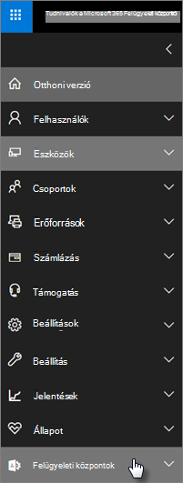

# A Microsoft 365 vállalati prémium verzió biztonsági és megfelelőségi funkciói

A Microsoft 365 vállalati prémium verzió egyszerűsített biztonsági funkciókat nyújt az adatvédelemhez PC-ken, telefonokon és táblaszámítógépeken.
    
## A Microsoft 365 felügyeleti központ biztonsági szolgáltatásai

A felügyeleti központ számos Microsoft 365 vállalati prémium verziós biztonsági funkcióját kezelheti, így egyszerűbben be-és kikapcsolhatja ezeket a funkciókat. A felügyeleti központban az alábbi műveleteket végezheti el:
  
- [Az Android-vagy iOS-eszközökhöz tartozó alkalmazások kezelésének beállításainak megadása](app-protection-settings-for-android-and-ios.md) 
    
    Ezekkel a beállításokkal megadhatja, hogy egy adott időszak után hogyan törölhet fájlokat egy inaktív eszközről, Titkosítsa a munkahelyi fájlokat, ami megköveteli a felhasználóknak a PIN-kód megadását.
    
- [Windows 10-es eszközök alkalmazás-védelmi beállításainak megadása](protection-settings-for-windows-10-devices.md) 
    
    Ezek a beállítások a cég tulajdonában lévő, illetve a személyes tulajdonú eszközökön egyaránt alkalmazhatók a vállalati adatokra.
    
- [Windows 10-es eszközök eszközbeállítások beállításainak megadása](protection-settings-for-windows-10-pcs.md) 
    
    A [BitLocker](https://go.microsoft.com/fwlink/p/?linkid=871405) -titkosítás engedélyezésével biztosíthatja az adatvédelmet abban az esetben, ha az eszköz elveszett vagy ellopták, és lehetővé teszi a Windows kisegítő [Gárda](https://docs.microsoft.com/windows/security/threat-protection/microsoft-defender-atp/enable-exploit-protection) számára a ransomware elleni speciális védelmet. 
    
- [Céges adatok eltávolítása az eszközökről](remove-company-data.md)
    
    Ha az eszköz elveszett, ellopta vagy egy alkalmazott elhagyja a céget, akkor távolról törölje a céges adatait.
    
- [Windows 10-es eszközök visszaállítása a gyári beállításokra](reset-devices-to-factory-settings.md) . 
    
    Alaphelyzetbe állíthatja azokat a Windows 10-es eszközöket, amelyekre az eszközbeállítások beállításai vonatkoznak.
    
## További biztonsági funkciókról 

A Microsoft 365 vállalati prémium verzió speciális funkciói, amelyek segítséget nyújtanak a vállalkozás számítógépes fenyegetésekkel szembeni védelmében és a bizalmas információk védelmében.
  
- **[Az Office 365 speciális veszélyforrások elleni védelem](https://docs.microsoft.com/microsoft-365/security/office-365-security/office-365-atp)**
    
    Advanced Threat Protection (ATP) segít megvédeni a vállalkozást a kifinomult adathalászat és a ransomware támadások ellen, amelyek veszélyeztethetik az alkalmazottak és az ügyfelek adatait. A funkciók a következők:
    
  - Kifinomult mellékletek beolvasása és az AI-alapú elemzés a veszélyes üzenetek észleléséhez és elvetéséhez.
    
  - Az e-mailekben lévő hivatkozások automatikus ellenőrzése annak megállapításához, hogy az adathalászati rendszer részét képezi-e. Így biztos lehet benne, hogy a nem biztonságos webhelyekhez hozzáfér.

- **[A Intune teljes képességei az Azure portálon](https://go.microsoft.com/fwlink/p/?linkid=871403)**
    
    Az Intune felügyeleti központ elérése az Azure portálján lehetővé teszi, hogy további biztonsági funkciókat (például MacOS-eszközök, iPhone-és Android-eszközök), valamint a Windows Advanced Device Management szolgáltatásait is beállítsa, amelyek nem érhetők el a Microsoft 365 felügyeleti központján keresztül.
- **Azonos [feltételes hozzáférés](https://docs.microsoft.com/azure/active-directory/conditional-access/overview) Azure ad Premium P1 csomaggal**

    A feltételes hozzáférés segíthet a szervezet védelmében a bejelentkezési kockázattól, az Access váratlan hálózatról vagy területi beállításról próbál meg hozzáférni, az Access megkísérel a kockázatos eszközök típusait stb. A feltételes hozzáférésű házirendek az első hitelesítés befejezése után érvényesek, és az első hitelesítési eseménytől kapott jeleket használják annak megállapításához, hogy a megkísérelt hozzáférés jóváhagyásra, visszautasításra vagy további bizonyításra van-e szükség (például második azonosító).

    A feltételes elérési funkciók a következők:

    - Hozzáférés a Felhasználónév, a csoport és a szerepkör alapján
    - Access [alkalmazáson alapuló](https://docs.microsoft.com/azure/active-directory/conditional-access/app-based-conditional-access) hozzáférés 
    - [Hely szerinti hozzáférés](https://docs.microsoft.com/azure/active-directory/authentication/howto-registration-mfa-sspr-combined#conditional-access-policies-for-combined-registration);  hozzáférés engedélyezése csak megbízható IP-tartományokból vagy adott országokból 
    - MFA szükséges az Accesshez
    - A [örökölt hitelesítést](https://docs.microsoft.com/azure/active-directory/conditional-access/block-legacy-authentication) használó alkalmazások hozzáférésének letiltása
    - Az alkalmazások használatához TP használata [Intune app Protection](https://docs.microsoft.com/azure/active-directory/conditional-access/app-protection-based-conditional-access)
    - Egyéni hitelesítés (például MFA) külső szolgáltatókkal (például DUO)
   
    Egyéb funkciók:
    - Önkiszolgáló [jelszó-visszaállítás](https://docs.microsoft.com/azure/active-directory/authentication/concept-sspr-customization) a hibrid Azure ad-hoz
    
## Megfelelőségi funkciók

Microsoft 365 vállalati prémium verzióra szóló előfizetése olyan funkciókat is tartalmaz, amelyek megkönnyítik a megfelelőségi és szabályozási szabványok megőrzését.

- **[Az adatveszteség-megelőzési házirendek](https://docs.microsoft.com/microsoft-365/compliance/data-loss-prevention-policies)** (DLP) áttekintése 
    
    A DLP beállítható úgy, hogy automatikusan észlelje a bizalmas információkat, például a hitelkártyák számát, a társadalombiztosítási számokat stb.
    
- **[Exchange Online Archiválás](https://products.office.com/exchange/microsoft-exchange-online-archiving-email)**
    
    Az Exchange Online archiválási licence lehetővé teszi, hogy az üzenetek folyamatos adatbiztonsági másolattal legyenek archiválva. A program az összes felhasználó e-mailjeit (például a törölt elemeket) tárolja abban az esetben, ha később szükségesek a felderítéshez vagy a helyreállításhoz. Emellett eltérő adatmegőrzési szabályok is használhatók a peres eljárásokban, a eDiscovery vagy a megfelelőségi követelményeknek való megfelelés érdekében.
    
- **[Érzékenységi címkék](https://docs.microsoft.com/microsoft-365/compliance/sensitivity-labels)**

   A Microsoft 365 vállalati prémium verzió az [Azure Information Protection Plan 1](https://go.microsoft.com/fwlink/p/?linkid=871407)összes funkcióját tartalmazza. Ezzel a csomaggal létrehozhat olyan **tartalmi címkéket** , amelyek lehetővé teszik a bizalmas adatokhoz való hozzáférés szabályozását az e-mailekben és a dokumentumokban, például a "ne legyen előre" és a "nem lehet másolni" beállítással. A bizalmas adatokat "bizalmasként" is osztályozhatja, és megadhatja, hogy a bizalmas információk hogyan oszthatók meg az üzleten kívül és azon belül is. A nagyvállalati szintű titkosítás egyszerűen alkalmazható az e-mailekre és a dokumentumokra az információk magánjellegű megőrzéséhez. Az Azure Information Protection Client bővítményt is telepítheti az Office-alkalmazásokhoz. További információt az [Azure Information Protection egységesített feliratozási ügyfélprogram](https://docs.microsoft.com/azure/information-protection/rms-client/unifiedlabelingclient-version-release-history)című témakörben találhat. Az érzékenységi címkékhez telepítse a **AzInfoProtection_UL.exe**.

Ezek a funkciók a biztonsági &amp; megfelelőségi központban és a Intune felügyeleti központban is kezelhetők. Idővel az egyszerűsített vezérlőelemek hozzáadódnak a Microsoft 365 felügyeleti központhoz.
  
    
## GYIK

 ### Elérhetők ezek a biztonsági szolgáltatások minden piacon?
  
Igen, ezek a funkciók minden olyan piacon elérhetők, ahol a Microsoft 365 vállalati prémium verzió értékesítve van.
  
### Hogyan találhatom meg a biztonsági &amp; megfelelőségi központot?
  
1. [Bejelentkezés a Microsoft 365 vállalati prémium](https://portal.microsoft.com/) verzióba a rendszergazdai hitelesítő adatokkal. 
    
2. A bal oldali navigációs sávon keresse meg a **felügyeleti központokat** , és bontsa ki. 
    
    
  
3. A **Biztonság &amp; megfelelősége** elemre koppintva lépjen a biztonsági &amp; megfelelőségi központba.
