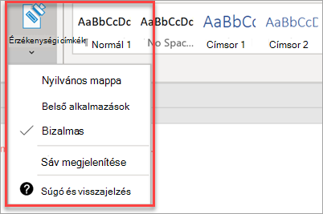

# Megfelelőségi szolgáltatások beállítása

A Microsoft 365 Vállalati prémium verzió olyan szolgáltatásokat tartalmaz, amelyek megvédik az adatait és az eszközeit, és segítenek Önnek biztonságban tartani ügyfelei és bizalmas információit.

## DLP-szolgáltatások beállítása

Lásd: [DLP-házirend](https://docs.microsoft.com/microsoft-365/compliance/create-a-dlp-policy-from-a-template) létrehozása sablonból, például arról, hogy miként állíthat be olyan házirendet, amely védelmet nyújt a személyes adatok elvesztésével szemben. 
  
A DLP számos használatra kész házirendsablont tartalmaz, amelyek számos különböző területi szabályhoz használhatók. Ilyen például az Ausztráliai pénzügyi adatokra, a Kanadai személyes adatokra vonatkozó törvény, az Amerikai Egyesült Államok pénzügyi adatai stb. A [teljes lista DLP-házirendsablonjai.](https://docs.microsoft.com/microsoft-365/compliance/what-the-dlp-policy-templates-include) Ezek a sablonok a pii sablon példához hasonlóan engedélyezhetők. 
  
## A levelezés megőrzésének beállítása az Exchange Online archiválásával

 **Az Exchange Online archiválási** licencelési funkciói a levelezési tartalmak elektronikus adatfeltáráshoz való megőrzésével segítik a megfelelőségi és szabályozási szabványok megőrzését. Az is segít csökkenteni a kockázatot, ha fennáll a peres eljárás, és lehetővé teszi az adatok helyreállítását biztonsági visszaélés vagy a törölt elemek helyreállítása után. Jogi visszatartás használatával megőrizheti egy felhasználó összes tartalmát, vagy adatmegőrzési házirendekkel testre szabhatja a megőrizni kívánt tartalmakat.
  
**Jogi hold:** A postaláda teljes tartalmát megőrizheti, beleértve a törölt elemeket is, ha a felhasználó teljes postaládáját jogi úton tartja meg. 
    
Egy postaláda jogi úton való felfüggesztése a Felügyeleti központban:
    
1. A bal oldali navigációs sávon a **Felhasználók** aktív felhasználók \> **csoportban.**
    
2. Jelölje ki azt a felhasználót, akinek a postaládáját jogi úton szeretné tartani. A felhasználói panelen bontsa ki a **Levelezési** beállításokat, és **a** További beállítások csoportban válassza **az Exchange-tulajdonságok szerkesztése lehetőséget.**
    
3. A felhasználó postaládalapján válassza a ** postaláda-funkciók ** lehetőséget a bal oldali navigációs sávon, majd válassza az **Engedélyezés** hivatkozást a Jogi eljárás miatti **tartás alatt.**
    
4. A jogi **hold párbeszédpanelen** megadhatja a jogi tartás időtartamát a Jogi tartás **időtartam mezőjében.** Hagyja üresen a mezőt, ha végtelen holdat szeretne hagyni. Jegyzeteket is adhat hozzá, és a postaláda-tulajdonost egy webhelyre irányíthatja, amelyről további magyarázatot kell mondania a jogi holdról. \>**Mentés gombra.**
    
**Adatmegőrzés:** Engedélyezheti a testre szabott adatmegőrzési házirendeket, például adott ideig megőrizheti őket, vagy véglegesen törölheti a tartalmakat az adatmegőrzési időszak végén. További információt az adatmegőrzési házirendek [áttekintése témakörben talál.](https://docs.microsoft.com/microsoft-365/compliance/retention-policies)

## Bizalmasság-címkék beállítása

A bizalmasság-címkék az Azure Information Protection (AIP) 1. csomagját tartalmazják, és címkék alkalmazásával segítik a dokumentumok és e-mailek osztályozását és szükség esetén védelmét. A címkéket automatikusan felhasználhatja a rendszergazdák, akik szabályokat és feltételeket definiálnak, a felhasználók manuálisan vagy egy olyan kombináció használatával, ahol a felhasználók javaslatokat kapnak.

A bizalmasság-címkék beállításához tekintse meg a [bizalmasság-címkék](https://support.microsoft.com/office/2fb96b54-7dd2-4f0c-ac8d-170790d4b8b9) létrehozásáról és kezelésről készült videót.

### Az Azure Information Protection ügyfél manuális telepítése

Az AIP-ügyfél manuális telepítése:

1. Töltse **AzinfoProtection_UL.exe** Microsoft [letöltőközpontból.](https://www.microsoft.com/download/details.aspx?id=53018)
 
2. Ha ellenőrizni tudja, hogy a telepítés működött-e,  megtekinthet egy Word-dokumentumot, és meggyőződhet arról, hogy a Bizalmasság beállítás elérhető a **Kezdőlap** lapon.
 

További információ: [Az ügyfélprogram telepítése.](https://docs.microsoft.com/azure/information-protection/infoprotect-tutorial-step3)
