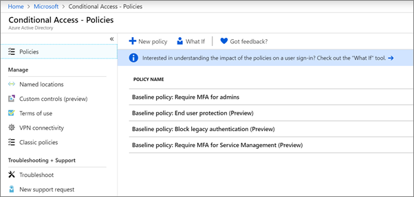

# Feltételes hozzáférési házirendek beállításaSet up conditional access policies

[A feltételes hozzáférési](https://docs.microsoft.com/azure/active-directory/conditional-access/overview) házirendek jelentős további biztonságot adnak hozzá.[Conditional access](https://docs.microsoft.com/azure/active-directory/conditional-access/overview) policies add substantial additional security. A Microsoft az összes ügyfél számára ajánlott alapkonfigurációs feltételes hozzáférési házirendek egy sorát biztosítja.Microsoft provides a set of baseline conditional access policies that are recommended for all customers. Az alapházirendek olyan előre definiált házirendek, amelyek segítenek megvédeni a szervezeteket számos gyakori támadással szemben.Baseline policies are a set of predefined policies that help protect organizations against many common attacks. Ezek a gyakori támadások közé tartozhat a jelszóspray, a visszajátszás és az adathalászat.These common attacks can include password spray, replay, and phishing.

Ezek a házirendek megkövetelik a rendszergazdáktól és a felhasználóktól, hogy bizonyos feltételek teljesülése esetén adjanak meg egy második hitelesítési formát (más néven többtényezős hitelesítést vagy MFA-t).These policies require admins and users to enter a second form of authentication (called multifactor authentication, or MFA) when certain conditions are met. Ha például egy felhasználó egy másik országból jelentkezik be, a bejelentkezés kockázatosnak tekinthető, és a felhasználónak egy további hitelesítési formát kell megadnia.For example, if a user is signing in from a different country, the sign-in might be considered risky and the user must provide an additional form of authentication. 

Jelenleg az alapházirendek a következőket tartalmazzák:Currently, baseline policies include the following:
- **A rendszergazdák többtényezős hitelesítésének megkövetelése többtényezős** &ndash; hitelesítést igényel a legtöbb kiemelt rendszergazdai szerepkörhöz, beleértve a globális rendszergazdát is.**Require MFA for admins** &ndash; Requires multi-factor authentication for the most privileged administrator roles, including global administrator.
- **A végfelhasználói védelem** &ndash; csak akkor igényel többtényezős hitelesítést a felhasználók számára, ha a bejelentkezés kockázatos.**End user protection** &ndash; Requires multi-factor authentication for users only when a sign-in is risky. 
- **Letiltás a régebbi hitelesítéssel** &ndash; Régebbi ügyfélalkalmazások és néhány új alkalmazás nem használ újabb, biztonságosabb hitelesítési protokollokat.**Block legacy authentication** &ndash; Older client apps and some new apps don't use newer, more secure, authentication protocols. Ezek a régebbi alkalmazások megkerülhetik a feltételes hozzáférési szabályzatokat, és jogosulatlan ultrásként juthatnak el a környezethez.These older apps can bypass conditional access policies and gain unauthorized access to your environment. Ez a házirend blokkolja a feltételes hozzáférést nem támogató ügyfelek hozzáférését.This policy blocks access from clients that don't support conditional access. 
- A &ndash; **szolgáltatáskezelés többtényezős hitelesítésének megkövetelése** többtényezős hitelesítést igényel a felügyeleti eszközökhöz való hozzáféréshez, beleértve az Azure Portalt is (ahol az alapházirendeket konfigurálja).**Require MFA for Service Management** &ndash; Requires multi-factor authentication for access to management tools, including Azure portal (where you configure baseline policies). 

A Microsoft azt javasolja, hogy engedélyezze az összes alapházirendet.Microsoft recommends you enable all of these baseline policies. Miután ezek a szabályzatok engedélyezve vannak, a rendszergazdák és a felhasználók kérik, hogy regisztráljon az Azure Multii-Factor hitelesítés.After these policies are enabled, admins and users will be prompted to register for Azure Multii-Factor authentication.

Ezekről a házirendekről további információt [a Mik az alapházirendek?](https://docs.microsoft.com/azure/active-directory/conditional-access/concept-baseline-protection)For more information about these policies, see [What are baseline policies](https://docs.microsoft.com/azure/active-directory/conditional-access/concept-baseline-protection)?

## Alapházirendek beállításaSet up baseline policies

1. Nyissa meg az [Azure Portalot,](https://portal.azure.com)majd keresse meg az **Azure Active Directory** \> **feltételes hozzáférését.**Go to [Azure portal](https://portal.azure.com), and then navigate to **Azure Active Directory** \> **Conditional Access**.
    
    Az alapházirendek az oldalon jelennek meg.The baseline policies are listed on the page.    
    
1. Az egyes házirendekhez tartozó alábbi utasításokat találja:See the following specific instructions for each policy:

  - [Többoldalz megkövetelése rendszergazdáknakRequire MFA for admins](https://docs.microsoft.com/azure/active-directory/conditional-access/howto-baseline-protect-administrators)
- [Többéves fa megkövetelése a felhasználók számáraRequire MFA for users](https://docs.microsoft.com/azure/active-directory/conditional-access/howto-baseline-protect-end-users)  
 - [Örökölt hitelesítés blokkolásaBlock legacy authentication](https://docs.microsoft.com/azure/active-directory/conditional-access/howto-baseline-protect-legacy-auth)
  - [Többéves fa megkövetelése a szolgáltatáskezeléshezRequire MFA for service management](https://docs.microsoft.com/azure/active-directory/conditional-access/howto-baseline-protect-azure)

Számos további szabályzatot is beállíthat, például jóváhagyott ügyfélalkalmazásokat igényel.You can set up many additional policies, such as requiring approved client apps. További információt a [Feltételes hozzáférés dokumentációjában](https://docs.microsoft.com/azure/active-directory/conditional-access/)talál.For more information, see the [Conditional Access Documentation](https://docs.microsoft.com/azure/active-directory/conditional-access/).
