# Mobileszközök beállítása a Microsoft 365 számára üzleti felhasználók nakSet up mobile devices for Microsoft 365 for business users

Az Office iPhone-ra vagy Android-telefonra való telepítéshez kövesse a lapokon szereplő utasításokat.Follow the instructions in the tabs to install Office on an iPhone or an Android phone. Miután elkövette ezeket a lépéseket, az Office-alkalmazásokban létrehozott munkafájlokat a Microsoft 365 vállalati verzió védi.After you follow these steps, your work files created in Office apps will be protected by Microsoft 365 for business.

A példa az Outlookra vonatkozik, de minden más, telepíteni kívánt Office-appra érvényes.The example is for Outlook, but applies for any other Office apps you want to install also.
  
## Mobileszközök beállításaSet up mobile devices

## [IphoneiPhone](#tab/iPhone)
  
Tekintse meg az Office-alkalmazások iOS-eszközökön való beállítását a Microsoft 365 vállalati verzióval.Watch a short video on how to set up Office apps on iOS devices with Microsoft 365 for business.  

> [!VIDEO https://www.microsoft.com/videoplayer/embed/RWee2n] 

Ha hasznosnak találta ezt a videót, tekintse meg a [teljes tanfolyamok kisvállalatoknak és Microsoft 365-újoncoknak](https://support.office.com/article/6ab4bbcd-79cf-4000-a0bd-d42ce4d12816) című cikket.If you found this video helpful, check out the [complete training series for small businesses and those new to Microsoft 365](https://support.office.com/article/6ab4bbcd-79cf-4000-a0bd-d42ce4d12816).

Nyissa meg az **App Store** áruházat, és írja be a Microsoft Outlook kifejezést a keresőmezőbe.Go to **App store**, and in the search field type in Microsoft Outlook.
  
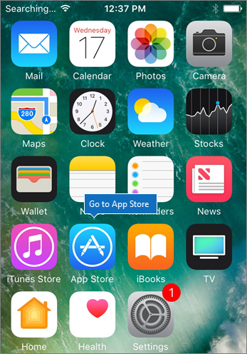
  
Az Outlook telepítéséhez koppintson a felhő ikonra.Tap the cloud icon to install Outlook.
  

  
Miután a telepítés befejeződött, koppintson a **Megnyitás** gombra az Outlook megnyitásához, majd koppintson az **Első lépések** elemre.When the installation is done, tap the **Open** button to open Outlook and then tap **Get Started**.
  
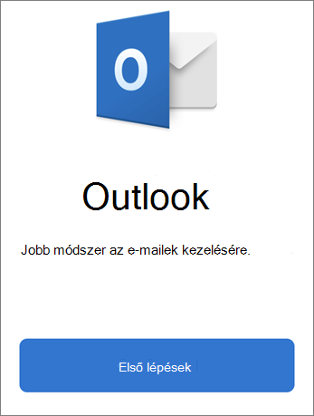
  
Adja meg munkahelyi e-mail címét a **Fiók hozzáadása** \> **Add Account**képernyőn, majd adja meg a Microsoft 365 vállalati hitelesítő adatokhoz \> **Jelentkezzen be.**Enter your work email address on the **Add Email Account** screen \> **Add Account**, and then enter your Microsoft 365 for business credentials \> **Sign in**.
  
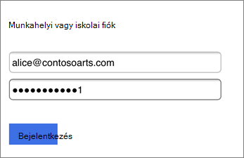
  
Ha a szervezet az alkalmazásokban lévő fájlokat védi, megjelenik egy párbeszédpanel, amely szerint a szervezet most védi az adatokat az alkalmazásban, és újra kell indítania az alkalmazást a további használathoz.If your organization is protecting files in apps, you'll see a dialog stating that your organization is now protecting the data in the app and you need to restart the app to continue to use it. Koppintson az **OK** gombra, és zárja be az Outlookot.Tap **OK** and close Outlook. 
  
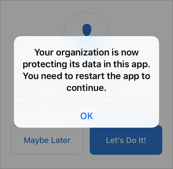
  
Keresse meg az Outlookot az iPhone-on, és indítsa újra.Locate Outlook on the iPhone, and restart it. Amikor a rendszer kéri, adjon meg egy PIN-kódot, és ellenőrizze azt.When prompted, enter a PIN and verify it. Az iPhone-ján az Outlook most már készen áll a használatra.Outlook on your iPhone is now ready to be used.
  
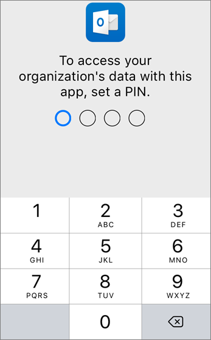
  
## [AndroidAndroid](#tab/Android)
  
Tekintse meg az Outlook és az Office Android-eszközökre történő telepítéséről szóló videót.Watch a video about installing Outlook and Office on Android devices.  

> [!VIDEO https://www.microsoft.com/videoplayer/embed/ecc2e9c0-bc7e-4f26-8b14-91d84dbcfef0] 

Ha hasznosnak találta ezt a videót, tekintse meg a [teljes tanfolyamok kisvállalatoknak és Microsoft 365-újoncoknak](https://support.office.com/article/6ab4bbcd-79cf-4000-a0bd-d42ce4d12816) című cikket.If you found this video helpful, check out the [complete training series for small businesses and those new to Microsoft 365](https://support.office.com/article/6ab4bbcd-79cf-4000-a0bd-d42ce4d12816).

Az Android-telefonon a beállítás megkezdéséhez nyissa meg a Play Áruházat.To begin setup on your Android phone, go to the Play Store.
  
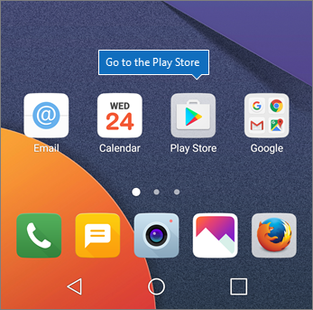
  
Írja be a Microsoft Outlook kifejezést a Google Play keresőmezőjébe, és koppintson a **Telepítés gombra.**Enter Microsoft Outlook in the Google Play search box and tap **Install**. Miután végzett az Outlook telepítésével, koppintson a **Megnyitás gombra.**Once Outlook is done installing, tap **Open**.
  
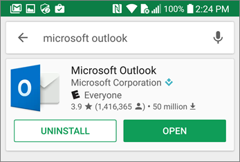
  
Az Outlook alkalmazásban koppintson az **Első lépések**elemre, majd adja hozzá a Microsoft 365 vállalati verziós e-mail fiókját, \> **és**jelentkezzen be a szervezeti hitelesítő adatokkal.In the Outlook app, tap **Get Started**, then add your Microsoft 365 for business email account \> **Continue**, and sign in with your organization credentials.
  
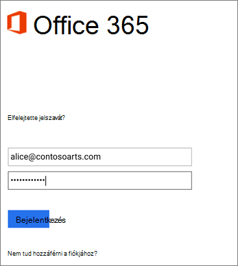
  
Az Intune Vállalati portál app telepítését kérő párbeszédpanelen, koppintson **Az áruház megnyitása** elemre.In the dialog that states you must install the Intune Company Portal app, tap **Go to store**.
  
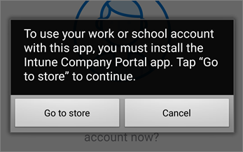
  
A Play Store alkalmazásban telepítse az Intune céges portálját.In Play Store, install Intune Company Portal.
  
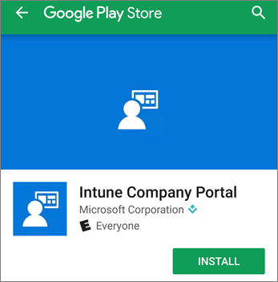
  
Nyissa meg ismét az Outlookot, és adja meg, majd erősítse meg a PIN-kódot. Az Outlook app mostantól készen áll a használatra.Open Outlook again, and enter and confirm a PIN. Your Outlook app is now ready for use.
  
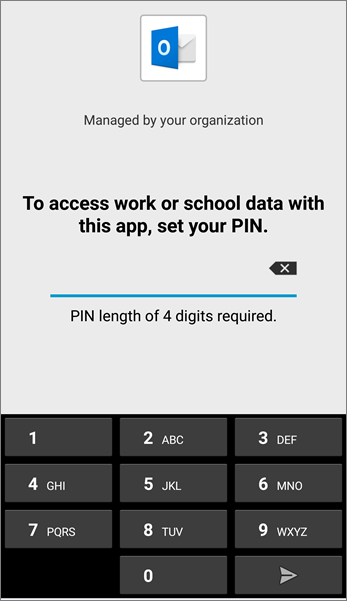

## Lásd mégSee also

[Microsoft 365 üzleti oktatóvideókMicrosoft 365 for business training videos](https://support.office.com/article/6ab4bbcd-79cf-4000-a0bd-d42ce4d12816)

---
