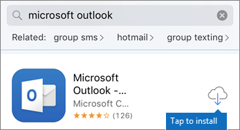

# Mobileszközök beállítása vállalati Microsoft 365 felhasználóknakSet up mobile devices for Microsoft 365 for business users

Az Office iPhone-ra vagy Android-telefonra való telepítéshez kövesse a lapokon szereplő utasításokat.Follow the instructions in the tabs to install Office on an iPhone or an Android phone. A lépések után a vállalati verziós appokban Office munkahelyi fájljait a vállalati Microsoft 365 fogja védeni.After you follow these steps, your work files created in Office apps will be protected by Microsoft 365 for business.

A példa az Outlookra vonatkozik, de minden más, telepíteni kívánt Office-appra érvényes.The example is for Outlook, but applies for any other Office apps you want to install also.
  
## Mobileszközök beállításaSet up mobile devices

## [iPhoneiPhone](#tab/iPhone)
  
Nézze meg ezt a rövid videót, amely bemutatja, hogy miként állíthat be Office alkalmazásokat iOS-eszközökön a Microsoft 365 vállalati verzióval.Watch a short video on how to set up Office apps on iOS devices with Microsoft 365 for business.  

> [!VIDEO https://www.microsoft.com/videoplayer/embed/RWee2n] 

Ha hasznosnak találta ezt a videót, tekintse meg a [teljes tanfolyamok kisvállalatoknak és Microsoft 365-újoncoknak](../business-video/index.yml) című cikket.If you found this video helpful, check out the [complete training series for small businesses and those new to Microsoft 365](../business-video/index.yml).

Nyissa meg az **App Store** áruházat, és írja be a Microsoft Outlook kifejezést a keresőmezőbe.Go to **App store**, and in the search field type in Microsoft Outlook.
  

  
Az Outlook telepítéséhez koppintson a felhő ikonra.Tap the cloud icon to install Outlook.
  

  
Miután a telepítés befejeződött, koppintson a **Megnyitás** gombra az Outlook megnyitásához, majd koppintson az **Első lépések** elemre.When the installation is done, tap the **Open** button to open Outlook and then tap **Get Started**.
  

  
Adja meg a munkahelyi e-mail-címét az E-mail-fiók **hozzáadása** képernyőn a Fiók hozzáadása képernyőn, majd adja meg Microsoft 365 Vállalati verziós hitelesítő \> adatokat. \> **Jelentkezzen be.**Enter your work email address on the **Add Email Account** screen \> **Add Account**, and then enter your Microsoft 365 for business credentials \> **Sign in**.
  

  
Ha a szervezete védelmet nyújt a fájloknak az appokban, megjelenik egy párbeszédpanel, amely arról közli, hogy a szervezet most már védi az appban lévő adatokat, és a használat folytatásához újra kell indítania az appot.If your organization is protecting files in apps, you'll see a dialog stating that your organization is now protecting the data in the app and you need to restart the app to continue to use it. Koppintson az **OK** gombra, és zárja be az Outlookot.Tap **OK** and close Outlook. 
  

  
Keresse meg az Outlookot az iPhone-on, és indítsa újra.Locate Outlook on the iPhone, and restart it. Amikor a rendszer kéri, adja meg és ellenőrizze a PIN-kódot.When prompted, enter a PIN and verify it. Az iPhone-ján az Outlook most már készen áll a használatra.Outlook on your iPhone is now ready to be used.
  

  
## [AndroidAndroid](#tab/Android)
  
Nézze meg ezt a videót arról, hogy mi Outlook az Office androidos eszközökön.Watch a video about installing Outlook and Office on Android devices.  

> [!VIDEO https://www.microsoft.com/videoplayer/embed/ecc2e9c0-bc7e-4f26-8b14-91d84dbcfef0] 

Ha hasznosnak találta ezt a videót, tekintse meg a [teljes tanfolyamok kisvállalatoknak és Microsoft 365-újoncoknak](../business-video/index.yml) című cikket.If you found this video helpful, check out the [complete training series for small businesses and those new to Microsoft 365](../business-video/index.yml).

Az Android-telefon beállításának megkezdéséhez kattintson a Play Store áruházra.To begin setup on your Android phone, go to the Play Store.
  

  
Írja be a Microsoft Outlook a Google Play keresőmezőbe, és koppintson a Telepítés **gombra.**Enter Microsoft Outlook in the Google Play search box and tap **Install**. Ha Outlook a telepítést, koppintson a Megnyitás **gombra.**Once Outlook is done installing, tap **Open**.
  

  
A Outlook appban koppintson az Első lépések **,** majd adja meg Microsoft 365 vállalati e-mail-fiókját a Folytatás gombra, és jelentkezzen be a szervezeti hitelesítő \> adataival.In the Outlook app, tap **Get Started**, then add your Microsoft 365 for business email account \> **Continue**, and sign in with your organization credentials.
  

  
Az Intune Vállalati portál app telepítését kérő párbeszédpanelen, koppintson **Az áruház megnyitása** elemre.In the dialog that states you must install the Intune Company Portal app, tap **Go to store**.
  

  
A Play Store-ban telepítse a Intune Céges portál.In Play Store, install Intune Company Portal.
  

  
Nyissa meg ismét az Outlookot, és adja meg, majd erősítse meg a PIN-kódot. Az Outlook app mostantól készen áll a használatra.Open Outlook again, and enter and confirm a PIN. Your Outlook app is now ready for use.
  

## Kapcsolódó tartalomRelated content

[Microsoft 365 vállalati verziós oktatóvideókMicrosoft 365 for business training videos](../business-video/index.yml)

---
