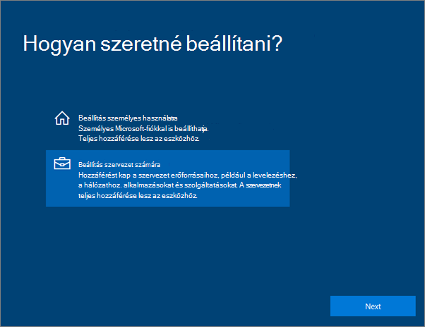
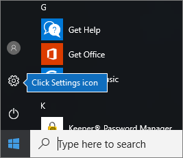
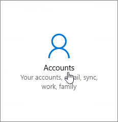
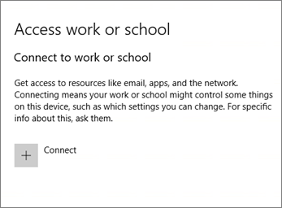
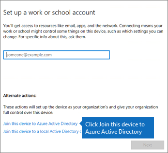
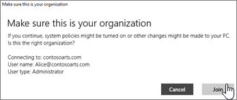
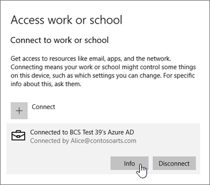
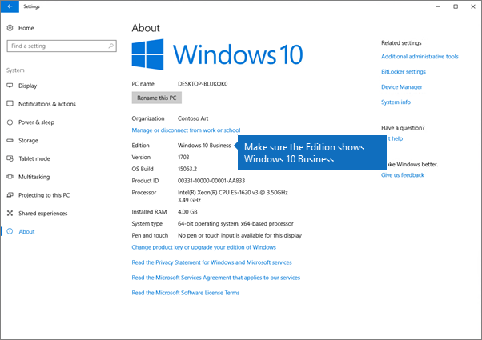

# Windows rendszerű eszközök beállítása a Microsoft 365 Business felhasználóinakSet up Windows devices for Microsoft 365 Business users

## A Windows-eszközök beállításának előfeltételei a Microsoft 365 Vállalati verzió felhasználói számáraPrerequisites for setting up Windows devices for Microsoft 365 Business users

Mielőtt beállítaná a Windows-eszközöket a Microsoft 365 Business felhasználóinál, győződjön meg arról, hogy az összes Windows-eszközön a Windows 10 Pro 1703-as verziója (alkotói frissítés) fut. A Windows 10 Pro megléte előfeltétele a Windows 10 Business üzembe helyezésének, amely a Windows 10 Prót kiegészítő felhőszolgáltatásokat és eszközkezelési lehetőségeket tartalmaz, és lehetővé teszi a Microsoft 365 Business központi kezelését és biztonsági szabályozását.Before you can set up Windows devices for Microsoft 365 Business users, make sure all the Windows devices are running Windows 10 Pro, version 1703 (Creators Update). Windows 10 Pro is a prerequisite for deploying Windows 10 Business, which is a set of cloud services and device management capabilities that complement Windows 10 Pro and enable the centralized management and security controls of Microsoft 365 Business.
  
Ha Ön Windows 7 Pro, Windows 8 Pro vagy Windows 8.1 Pro rendszerű Windows-eszközökkel rendelkezik, akkor Microsoft 365 Business-előfizetése feljogosítja a Windows 10-re való frissítésre.If you have Windows devices running Windows 7 Pro, Windows 8 Pro, or Windows 8.1 Pro, your Microsoft 365 Business subscription entitles you to a Windows 10 upgrade.
  
Ha többet szeretne megtudni arról, hogy hogyan frissítheti Windows-eszközeit a Windows 10 Pro alkotói frissítésére, kövesse a következő témakörben szereplő lépéseket: [Windows-eszközök frissítése a Windows Pro alkotói frissítésére](upgrade-to-windows-pro-creators-update.md).For more information on how to upgrade Windows devices to Windows 10 Pro Creators Update, follow the steps in this topic: [Upgrade Windows devices to Windows Pro Creators Update](upgrade-to-windows-pro-creators-update.md).
  
[Lásd: Az eszköz csatlakoztatva van az Azure AD-hez,](#verify-the-device-is-connected-to-azure-ad) és ellenőrizze, hogy rendelkezik-e a frissítéssel, vagy győződjön meg arról, hogy a frissítés működött.See [Verify the device is connected to Azure AD](#verify-the-device-is-connected-to-azure-ad) to verify you have the upgrade, or to make sure the upgrade worked.

Nézzen meg egy rövid videót a Windows Microsoft 365-höz való csatlakoztatásáról.Watch a short video about connecting Windows to Microsoft 365.  

> [!VIDEO https://www.microsoft.com/videoplayer/embed/RE3yXh3] 

Ha hasznosnak találta ezt a videót, tekintse meg a [teljes tanfolyamok kisvállalatoknak és Microsoft 365-újoncoknak](https://support.office.com/article/6ab4bbcd-79cf-4000-a0bd-d42ce4d12816) című témakört.If you found this video helpful, check out the [complete training series for small businesses and those new to Microsoft 365](https://support.office.com/article/6ab4bbcd-79cf-4000-a0bd-d42ce4d12816).
  
## Windows 10-es eszközök csatlakoztatása a szervezet Azure AD szolgáltatásáhozJoin Windows 10 devices to your organization's Azure AD

Ha a szervezet összes Windows-eszköze frissítve lett a Windows 10 Pro Creators update szolgáltatásra, vagy már windows 10 Pro Creators Update szolgáltatást futtat, csatlakoztathatja ezeket az eszközöket a szervezet Azure Active Directoryjához.When all Windows devices in your organization have either been upgraded to Windows 10 Pro Creators Update or are already running Windows 10 Pro Creators Update, you can join these devices to your organization's Azure Active Directory. Az eszközök csatlakoztatása után automatikusan frissítjük őket a Windows 10 Business rendszerre, amely a Microsoft 365 Vállalati verziós előfizetés része.Once the devices are joined, they'll be automatically upgraded to Windows 10 Business, which is part of your Microsoft 365 Business subscription.
  
### Vadonatúj vagy újonnan frissített Windows 10 Pro-eszköz eseténFor a brand new, or newly upgraded, Windows 10 Pro device

A Windows 10 Pro alkotói frissítését futtató vadonatúj eszköz, illetve egy olyan eszköz esetén, amely frissítve lett ugyan a Windows 10 Pro alkotói frissítésére, de még nem lett elvégezve rajta a Windows 10-es eszköz beállítása, kövesse az alábbi lépéseket.For a brand new device running Windows 10 Pro Creators Update, or for a device that was upgraded to Windows 10 Pro Creators Update but has not gone through Windows 10 device setup, follow these steps.
  
1. Kezdje meg a Windows 10-es eszköz beállítását, amíg a **Hogyan szeretné beállítani?** lapra nem jut.Go through Windows 10 device setup until you get to the **How would you like to set up?** page. 
    
    
  
2. Itt válassza a **Beállítás szervezeti használatra** lehetőséget, és adja meg a Microsoft 365 Businesshez használt felhasználónevét és jelszavát.Here, choose **Set up for an organization** and then enter your username and password for Microsoft 365 Business. 
    
3. Fejezze be a Windows 10-es eszköz beállítását.Finish Windows 10 device setup.
    
   Ha végzett, a felhasználó csatlakoztatva lesz a szervezet Azure AD szolgáltatásához. Ha meg szeretne győződni arról, hogy sikerült-e a csatlakoztatás, olvassa el az [Annak ellenőrzése, hogy az eszköz csatlakoztatva van-e az Azure AD szolgáltatáshoz](#verify-the-device-is-connected-to-azure-ad) című szakaszt.Once you're done, the user will be connected to your organization's Azure AD. See [Verify the device is connected to Azure AD](#verify-the-device-is-connected-to-azure-ad) to make sure. 
  
### Már beállított és a Windows 10 Prót futtató eszköz eseténFor a device already set up and running Windows 10 Pro

 **Felhasználók csatlakoztatása az Azure AD-hez:****Connect users to Azure AD:**
  
1. A felhasználó Windows rendszerű PC-jén, amelyen a Windows 10 Pro 1703-as verziója (alkotói frissítés) fut (lásd [előfeltételek](pre-requisites-for-data-protection.md)), kattintson a Windows emblémára, majd a Beállítások ikonra.In your user's Windows PC, that is running Windows 10 Pro, version 1703 (Creators Update) (see [pre-requisites](pre-requisites-for-data-protection.md)), click the Windows logo, and then the Settings icon.
  
   
  
2. A **Beállítások** lapon válassza a **Fiókok** lehetőséget.In **Settings**, go to **Accounts**.
  
   
  
3. **Az Ön adatai** lapon kattintson a **Hozzáférés munkahelyi vagy iskolai rendszerhez** \> **Csatlakozás** elemre.On **Your info** page, click **Access work or school** \> **Connect**.
  
   
  
4. A **Munkahelyi vagy iskolai fiók beállítása** párbeszédpanel **Más műveletek** csoportjában válassza **Az eszköz csatlakoztatása az Azure Active Directoryhoz** lehetőséget.On the **Set up a work or school account** dialog, under **Alternate actions**, choose **Join this device to Azure Active Directory**.
  
   
  
5. On the **Let's get you signed in** page, enter your work or school account \> **Next**.On the **Let's get you signed in** page, enter your work or school account \> **Next**.
  
   On the **Enter password** page, enter your password \> **Sign in**.On the **Enter password** page, enter your password \> **Sign in**.
  
   
  
6. A **Ellenőrizze, hogy ez a szervezet lapja-e,** ellenőrizze, hogy az adatok helyesek-e, majd kattintson a **Csatlakozás**gombra.On the **Make sure this is your organization** page, verify that the information is correct, and click **Join**.
  
   A **Minden készen áll** lapon kattintson a **Kész** elemre.On the **You're all set!** page, click **Done**.
  
   
  
Szinkronizálja újból a OneDrive Vállalati verzióba esetleg feltöltött fájlokat.If you uploaded files to OneDrive for Business, sync them back down. Ha harmadik féltől származó eszközt használt a profil és a fájlok áttelepítéséhez, szinkronizálja azokat az új profillal is.If you used a third-party tool to migrate profile and files, also sync those to the new profile.
  
## Annak ellenőrzése, hogy az eszköz csatlakoztatva van-e az Azure AD szolgáltatáshozVerify the device is connected to Azure AD

A szinkronizálási állapot ellenőrzéséhez a **Hozzáférés munkahelyi vagy iskolai rendszerhez** lap **Beállítások** csoportjában kattintson a **Csatlakoztatva** _ \<organization name\> _ területre az **Információ** és a **Leválasztás** gomb megjelenítéséhez. Kattintson az **Információ** gombra a szinkronizálás állapotának megjelenítéséhez.To verify your sync status, on the **Access work or school** page in **Settings**, click in the **Connected to** _ \<organization name\> _ area to expose the buttons **Info** and **Disconnect**. Click on **Info** to get your synchronization status. 
  
A Szinkronizálás állapota lapon a Szinkronizálás elemre kattintva beszerezheti a legújabb mobileszköz-kezelési házirendeket a PC-re.On the Sync status page, click Sync to get the latest mobile device management policies onto the PC.
  
A Microsoft 365 Vállalati verzió szoláris használatának megkezdéséhez nyissa meg a Windows **Start** gombot, kattintson a jobb gombbal az aktuális fiókképére, majd **váltson fiókközött.**To start using the Microsoft 365 Business account, go to the Windows **Start** button, right-click your current account picture, and then **Switch account**. Jelentkezzen be a szervezeti e-mail-címével és jelszavával.Sign in by using your organization email and password.
  

  
## Annak ellenőrzése, hogy az eszköz frissítve lett-e a Windows 10 Business verzióraVerify the device is upgraded to Windows 10 Business

Ellenőrizheti, hogy megtörtént-e az Azure AD szolgáltatáshoz csatlakoztatott Windows 10-es eszközök frissítése Windows 10 Business verzióra, a Microsoft 365 Business-előfizetése részeként.Verify that your Azure AD joined Windows 10 devices were upgraded to Windows 10 Business as part of your Microsoft 365 Business subscription.
  
1. Válassza a **Beállítások** \> **Rendszer** \> **Névjegy** lehetőséget.Go to **Settings** \> **System** \> **About**.
    
2. Győződjön meg arról, hogy a **Kiadás** feliratnál a **Windows 10 Business** terméknév szerepel.Confirm that the **Edition** shows **Windows 10 Business**.
    
    
  
## Következő lépésekNext steps

A mobileszközök beállításáról a [Mobileszközök beállítása a Microsoft 365 Business felhasználóinak](set-up-mobile-devices.md), az eszközvédelmi vagy appvédelmi beállítások megadásáról pedig [A Microsoft 365 Business kezelése](manage.md) című témakörben tájékozódhat.To set up your mobile devices, see [Set up mobile devices for Microsoft 365 Business users](set-up-mobile-devices.md), To set device protection or app protection policies, see [Manage Microsoft 365 Business](manage.md).
  
## További információk a Microsoft 365 Business beállításával és használatával kapcsolatosFor more on setting up and using Microsoft 365 Business

[Microsoft 365 Vállalati verziós oktatóvideókMicrosoft 365 Business training videos](https://support.office.com/article/6ab4bbcd-79cf-4000-a0bd-d42ce4d12816)
