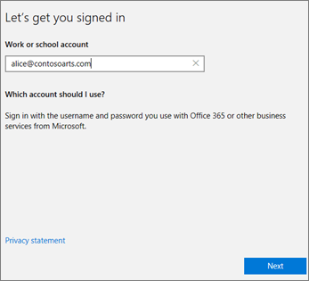

# Windows-eszközök beállítása a Microsoft 365 vállalati prémium verzió felhasználóinak

## A Windows-eszközök Microsoft 365 vállalati prémium verziós felhasználóknak való beállításának előfeltételei

Mielőtt beállíthatja a Windows-eszközöket a Microsoft 365 vállalati prémium verzió felhasználóinak, győződjön meg arról, hogy minden Windows-eszközön Windows 10 Pro, 1703-es verzió (alkotók frissítése) fut. Windows 10 Pro a Windows 10 Business központi telepítésének előfeltétele, amely a Windows 10 Pro rendszerhez készült felhőalapú szolgáltatások és eszközkezelés, valamint a Microsoft 365 vállalati prémium verzió központi kezelési és biztonsági ellenőrzésének engedélyezése.
  
Ha Windows 7 Pro, Windows 8 Pro vagy Windows 8,1 Pro rendszerű Windows-eszközökkel rendelkezik, Microsoft 365 vállalati prémium verzióra szóló előfizetése feljogosítja a Windows 10-es frissítésre.
  
Ha többet szeretne megtudni arról, hogy hogyan frissítheti Windows-eszközeit a Windows 10 Pro alkotói frissítésére, kövesse a következő témakörben szereplő lépéseket: [Windows-eszközök frissítése a Windows Pro alkotói frissítésére](upgrade-to-windows-pro-creators-update.md).
  
Ellenőrizze, hogy az [eszköz csatlakoztatva van](#verify-the-device-is-connected-to-azure-ad) -e az Azure ad-hoz, és ellenőrizze, hogy rendelkezik-e a frissítéssel, vagy hogy biztosan működött-e a frissítés.

Nézze meg ezt a rövid videót a Windows csatlakoztatásáról a Microsoft 365-ra.  

> [!VIDEO https://www.microsoft.com/videoplayer/embed/RE3yXh3] 

Ha hasznosnak találta ezt a videót, tekintse meg a [teljes tanfolyamok kisvállalatoknak és Microsoft 365-újoncoknak](https://support.microsoft.com/office/6ab4bbcd-79cf-4000-a0bd-d42ce4d12816) című cikket.
  
## Windows 10-es eszközök csatlakoztatása a szervezet Azure AD szolgáltatásához

Ha a szervezet minden Windows-eszköze frissítve lett a Windows 10-es Pro-készítők frissítésére, vagy már Windows 10-es Pro Creators frissítést futtat, ezek az eszközök a szervezet Azure Active Directoryhoz is bekapcsolódnak. Az eszközök csatlakoztatása után a rendszer automatikusan frissíti őket a Windows 10 Business verzióra, amely része a Microsoft 365 vállalati prémium verziós előfizetésnek.
  
### Vadonatúj vagy újonnan frissített Windows 10 Pro-eszköz esetén

A Windows 10 Pro alkotói frissítését futtató vadonatúj eszköz, illetve egy olyan eszköz esetén, amely frissítve lett ugyan a Windows 10 Pro alkotói frissítésére, de még nem lett elvégezve rajta a Windows 10-es eszköz beállítása, kövesse az alábbi lépéseket.
  
1. Kezdje meg a Windows 10-es eszköz beállítását, amíg a **Hogyan szeretné beállítani?** lapra nem jut. 
    
    
  
2. Itt válassza a **beállítás szervezethez** lehetőséget, majd adja meg a Microsoft 365 vállalati prémium verzió felhasználónevét és jelszavát. 
    
3. Fejezze be a Windows 10-es eszköz beállítását.
    
   Ha végzett, a felhasználó csatlakoztatva lesz a szervezet Azure AD szolgáltatásához. Ha meg szeretne győződni arról, hogy sikerült-e a csatlakoztatás, olvassa el az [Annak ellenőrzése, hogy az eszköz csatlakoztatva van-e az Azure AD szolgáltatáshoz](#verify-the-device-is-connected-to-azure-ad) című szakaszt. 
  
### Már beállított és a Windows 10 Prót futtató eszköz esetén

 **Felhasználók csatlakoztatása az Azure AD-hez:**
  
1. A felhasználó Windows rendszerű PC-jén, amelyen a Windows 10 Pro 1703-as verziója (alkotói frissítés) fut (lásd [előfeltételek](pre-requisites-for-data-protection.md)), kattintson a Windows emblémára, majd a Beállítások ikonra.
  
   
  
2. A **Beállítások** lapon válassza a **Fiókok** lehetőséget.
  
   
  
3. **Az Ön adatai** lapon kattintson a **Hozzáférés munkahelyi vagy iskolai rendszerhez** \> **Csatlakozás** elemre.
  
   
  
4. A **Munkahelyi vagy iskolai fiók beállítása** párbeszédpanel **Más műveletek** csoportjában válassza **Az eszköz csatlakoztatása az Azure Active Directoryhoz** lehetőséget.
  
   
  
5. On the **Let's get you signed in** page, enter your work or school account \> **Next**.
  
   On the **Enter password** page, enter your password \> **Sign in**.
  
   
  
6. A győződjön meg arról, hogy **Ez a szervezet** lapja, ellenőrizze, hogy az adatok helyesek-e, és válassza a **Csatlakozás** lehetőséget.
  
   A minden készen áll **!** Lap, válasszon másikat **végzett**.
  
   
  
Szinkronizálja újból a OneDrive Vállalati verzióba esetleg feltöltött fájlokat. Ha harmadik féltől származó eszközt használ a profil és a fájlok áttelepítéséhez, az új profilba is szinkronizálja őket.
  
## Annak ellenőrzése, hogy az eszköz csatlakoztatva van-e az Azure AD szolgáltatáshoz

A szinkronizálás állapotának ellenőrzéséhez a **beállításokban** a **hozzáférés munkahelyi vagy iskolai** lapján jelölje be a **kapcsolat** _ \<organization name\> _ területhez választógombot, és válassza ki a gombok **adatait** , majd **válassza a leválasztás** lehetőséget. A szinkronizálási állapot eléréséhez válassza az **információ** lehetőséget. 
  
A **szinkronizálás állapota** lapon a **szinkronizálás** gombra koppintva nyissa meg a legújabb mobileszköz-kezelési házirendeket a PC-re.
  
A Microsoft 365 vállalati prémium verzió használatának megkezdéséhez lépjen a Windows **Start** gombjára, kattintson a jobb gombbal az aktuális fiók képére, és válassza a **fiók váltása** parancsot. Jelentkezzen be a szervezeti e-mail-címével és jelszavával.
  

  
## Annak ellenőrzése, hogy a számítógép frissítve lett-e a Windows 10 Business verzióra

Győződjön meg arról, hogy a Microsoft 365 vállalati prémium verzióra szóló előfizetése részeként az Azure AD csatlakozik Windows 10-es eszközeit a Windows 10 Business verzióra frissítette.
  
1. Válassza a **Beállítások** \> **Rendszer** \> **Névjegy** lehetőséget.
    
2. Győződjön meg arról, hogy a **Kiadás** feliratnál a **Windows 10 Business** terméknév szerepel.
    
    
  
## Következő lépések

A mobileszközök beállításáról a [mobileszközök beállítása a microsoft 365 vállalati prémium verzió felhasználóinak](set-up-mobile-devices.md)című témakörben olvashat a [Microsoft 365 vállalati verzió kezelése](manage.md)című témakörben.
  
## További információ a Microsoft 365 Business Premium beállításáról és használatáról

[Microsoft 365 vállalati verziós képzési videók](https://support.microsoft.com/office/6ab4bbcd-79cf-4000-a0bd-d42ce4d12816)
