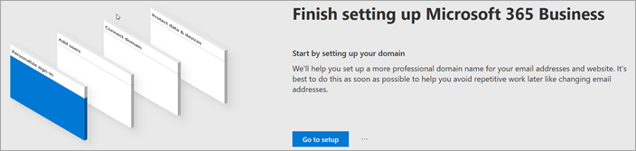
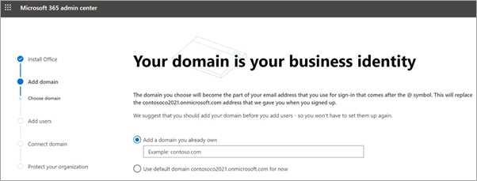
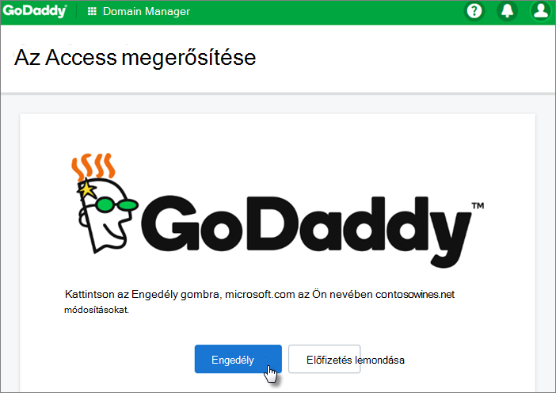
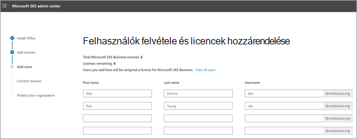
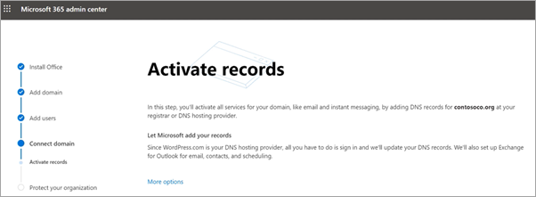
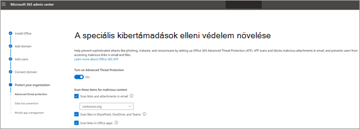
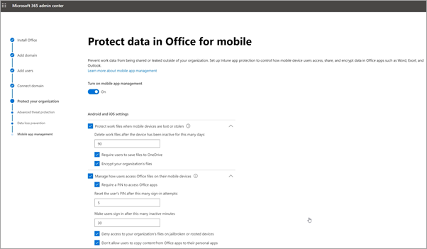

# A Microsoft 365 Vállalati prémium verzió beállítása a beállítási varázslóban

Ez a videó áttekintést nyújt a Microsoft 365 Vállalati prémium verzió beállításról.  

> [!VIDEO https://www.microsoft.com/videoplayer/embed/RE4jZwg] 

## Tartomány, felhasználók hozzáadása és házirendek beállítása

A Microsoft 365 Business Premium megvásárlásakor lehetősége van arra, hogy saját tartományát használja, vagy a regisztráció során [vásároljon egyet.](sign-up.md)

- Ha a feliratkozáskor új tartományt vásárolt, akkor a tartománya be van állítva, és a Felhasználók hozzáadása és licencek hozzárendelése gombra kell [lépnie.](#add-users-and-assign-licenses)

### Tartomány hozzáadása a bejelentkezés személyre szabása

1. Jelentkezzen be a [Microsoft 365 Felügyeleti központba](https://admin.microsoft.com) a globális rendszergazdai hitelesítő adataival. 

2. A **varázslót az Ugrás** a beállításra gombra állítva indítsa el.

    

3. Az **Office-appok telepítése lapon** szükség esetén telepítheti az appokat a saját számítógépére.
    
4. A **Tartomány hozzáadása lépésben** adja meg a használni kívánt tartománynevet (például contoso.com).

    > [!IMPORTANT]
    > Ha a regisztráció során tartományt vásárolt, itt nem fogja látni **a** Tartomány hozzáadása lépést. Ehelyett a [Felhasználók hozzáadása gombra](#add-users-and-assign-licenses) kell azt felvennie.

    

    
4. A varázsló lépéseit követve hozza létre a DNS-rekordokat bármely DNS-szolgáltatónál a [Microsoft 365](/office365/admin/get-help-with-domains/create-dns-records-at-any-dns-hosting-provider) számára, amely igazolja, hogy Öné a tartomány. Ha ismeri a tartományát, olvassa el a [szolgáltatóra vonatkozó utasításokat is.](/office365/admin/get-help-with-domains/set-up-your-domain-host-specific-instructions)

    Ha az Ön tárhelyszolgáltatója a GoDaddy vagy más szolgáltató, amely támogatja a tartomány [csatlakoztatását,](/office365/admin/get-help-with-domains/domain-connect)a folyamat egyszerű, és a rendszer automatikusan kérni fogja, hogy jelentkezzen be, és a Microsoft hitelesítse magát az Ön nevében.

    

### Felhasználók felvétele és licencek hozzárendelése

Felvehet felhasználókat a varázslóba, de  később a Felügyeleti központban is. Ha pedig helyi tartományvezérlője van, felhasználókat is felvehet az [Azure AD Connect használatával.](/azure/active-directory/hybrid/how-to-connect-install-express)

#### Felhasználók hozzáadása a varázslóban

A varázslóban automatikusan hozzárendel egy Microsoft 365 Vállalati prémium verziós licencet.

1. Ha Microsoft 365 Vállalati prémium verziós előfizetése már rendelkezik felhasználókkal (például ha az Azure AD Connectet használta), akkor most lehetősége van licenceket rendelni hozzájuk. Nyugodtan felvehet licenceket hozzájuk is.

2. A felhasználók hozzáadása után a hitelesítő adatokat is megoszthatja a felvett új felhasználókkal. Ezeket kinyomtathatja, elküldheti e-mailben, vagy pedig letöltheti.

### Tartomány csatlakoztatása

> [!NOTE]
> Ha az .onmicrosoft tartományt választotta, vagy az Azure AD Connect segítségével beállította a felhasználókat, ez a lépés nem látható.
  
A szolgáltatások beállításához frissítenie kell bizonyos rekordokat a DNS-szolgáltatónál vagy a tartományregisztrálónál.
  
1. A beállítási varázsló általában felismeri a regisztrálóját, és részletes útmutatást jelenít meg arról, hogy miként frissítheti a névkiszolgálói rekordokat a regisztráló webhelyén. Ha nem, módosítsa a névkiszolgálókat úgy, hogy a [Microsoft 365-öt bármely tartományregisztrálónál beállítsa.](../admin/get-help-with-domains/change-nameservers-at-any-domain-registrar.md) 

    - Ha van meglévő DNS-rekordja, például egy meglévő webhelye, de a DNS-szolgáltató engedélyezve van a [tartományhoz](/office365/admin/get-help-with-domains/domain-connect)való csatlakozáshoz, válassza a Rekordok hozzáadása **lehetőséget.** A Choose **your online services (Online szolgáltatások kiválasztása)** lapon fogadja el az összes alapértelmezett beállítást, és válassza a **Tovább**, majd az **Authorize** (Engedély) lehetőséget a DNS-szolgáltatója lapján.
    - Ha más DNS-szolgáltatónál már van DNS-rekordja (a tartomány csatlakoztatása nem engedélyezett), akkor saját DNS-rekordjait kell kezelnie, hogy a meglévő szolgáltatások kapcsolatban maradjanak. További [információt a tartományokkal kapcsolatos alapismeretek](/office365/admin/get-help-with-domains/dns-basics) között található.

        

2. Kövesse a varázsló lépéseit, és állítsa be Önnek a levelezést és más szolgáltatásokat.

### A szervezet védelme 

A varázslóban beállított házirendek automatikusan vonatkoznak a Minden [felhasználó](/office365/admin/create-groups/compare-groups#security-groups) nevű biztonsági *csoportra.* További csoportokat is létrehozhat, amelyekhez házirendeket rendelhet hozzá a Felügyeleti központban.

1. A speciális kiberfenyegetések elleni védelem növelése érdekében javasoljuk, hogy hagyja, hogy az [Office 365 Előzetes](../security/office-365-security/defender-for-office-365.md) veszélyforrások elleni védelem megvizsgálja az Office-appok fájljait és hivatkozásait.

    

2. A  Bizalmas adatok kiszivárgásának megakadályozása lapon fogadja el az Office 365 Adatveszteség-megelőzés (DLP) alapértelmezett beállítását a bizalmas adatok nyomon követéséhez az Office-appokban, valamint annak érdekében, hogy megakadályozza ezeknek a szervezeten kívüli véletlen megosztását.

3. Az Adatok **védelme az Office mobilappban** lapon hagyja be a mobilappok kezelését, bontsa ki a beállításokat, és tekintse át őket, majd válassza a Mobilappkezelési házirend **létrehozása lehetőséget.**

    

## Windows 10-es PC-k biztonságossá teve

A bal oldali  navigációs sávon válassza a Beállítás lehetőséget, majd a Bejelentkezés és biztonság alatt válassza A **Windows 10-es számítógépek biztonságának biztosítása lehetőséget.** Első **lépésekhez** válassza a Nézet lehetőséget. Részletes útmutatásért olvassa el a [Windows 10-es](secure-win-10-pcs.md) számítógépek biztonságának biztosítása vonatkozó utasításokat.

## Office 365-ügyfélalkalmazások telepítése

Ha a telepítés során az Office-appok automatikus telepítését választotta, az appok a Windows 10-es eszközökre fognak telepíteni, miután a felhasználók bejelentkeztek az Azure AD szolgáltatásba a windowsos eszközükről a munkahelyi hitelesítő adataik használatával.

Az Office mobil iOS- vagy Android-eszközökre való telepítéséhez lásd: Mobileszközök beállítása a [Microsoft 365 Business Premium felhasználóinak.](set-up-mobile-devices.md)

Az Office-t külön is telepítheti. Útmutatásért olvassa el Az [Office telepítése PC-re vagy Mac](https://support.microsoft.com/office/4414eaaf-0478-48be-9c42-23adc4716658) gépre.

## Lásd még

[Microsoft 365 Vállalati verzió – oktatóvideók](https://support.microsoft.com/office/6ab4bbcd-79cf-4000-a0bd-d42ce4d12816)
