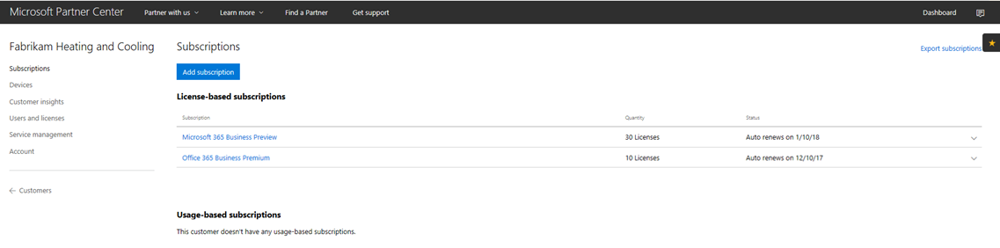
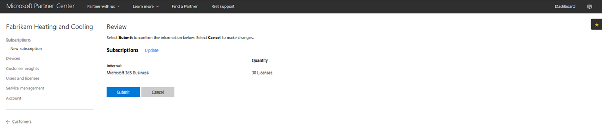
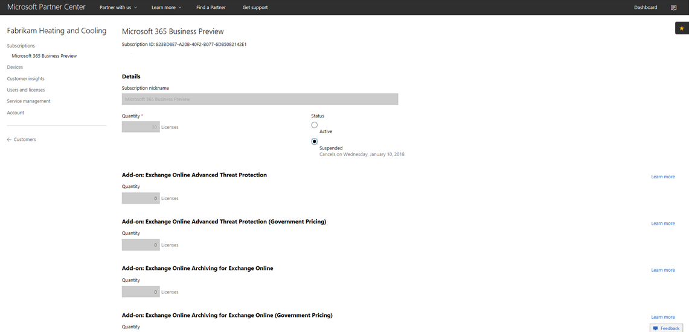
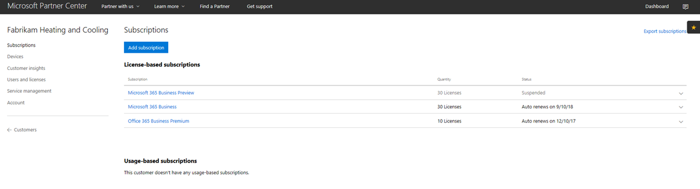
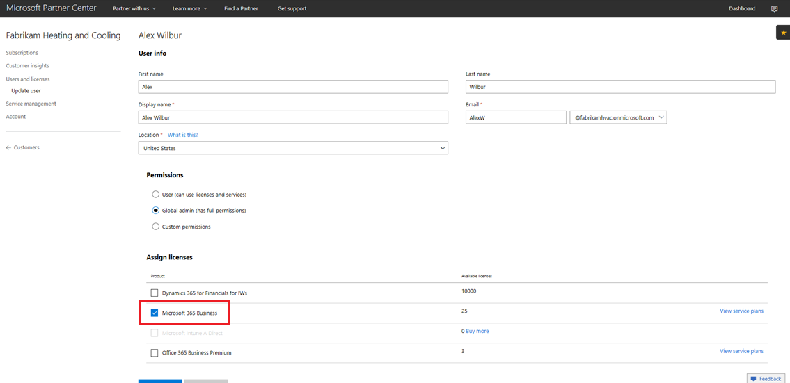

# Áttérés Microsoft 365 vállalati CSP-előfizetésre

Ha Microsoft 365 Business Preview CSP-előfizetéssel rendelkezik, kövesse az alábbi útmutatót, amelyből megtudhatja, hogyan válthatja át meglévő előzetes előfizetését a Microsoft 365 Vállalati GA-ra (általános elérhetőség).

**Előzetes verziós előfizetés váltása GA-ra**

1. Jelentkezzen be a <a href="https://partnercenter.microsoft.com" target="_blank">Partnerközpontba</a>.
2. Az irányítópulton válassza a **Vevők**lehetőséget, majd keresse meg és válassza ki a vállalat nevét.

    A vállalat előfizetései megjelennek.

    
    
3. A vállalat **Előfizetések** lapján válassza az **Előfizetés hozzáadása lehetőséget.**
4. Az **Új előfizetés** lapon válassza a **Kisvállalkozás** lehetőséget, majd a listából válassza a **Microsoft 365 Vállalati verzió** lehetőséget.
5. Adja hozzá a licencek számát, majd válassza a **Tovább: Ellenőrzés** lehetőséget az előfizetés áttekintéséhez, majd válassza a **Küldés lehetőséget.**

    

    A **licencalapú előfizetések** a **Microsoft 365 Business Preview** és a Microsoft **365 Business programot**jelenítik meg. Ezután felfüggeszti az előzetes verzióra szóló előfizetést.

6. Válassza a **Microsoft 365 Vállalati előzetes verzió**lehetőséget.
7. A **Microsoft 365 Vállalati előzetes verzió** lapon válassza a **Felfüggesztett** lehetőséget az előzetes verzióra szóló előfizetés felfüggesztéséhez.

    

8. A **megerősítéshez** válassza a Küldés lehetőséget.

    Az **Előfizetések** lapon ellenőrizze, hogy a **Microsoft 365 Vállalati előzetes verzió** állapota A **Felfüggesztett**állapot látható.

    

9. Opcionálisan a licencszerződést is érvényesítheti. Ehhez kövesse az alábbi lépéseket:
    1. Válassza a **Felhasználók és licencek** lehetőséget a vállalat **Előfizetések** lapján.
    2. A **Felhasználók és licencek** lapon jelöljön ki egy felhasználót.
    3. A felhasználó lapján ellenőrizze a **Licencek hozzárendelése szakaszt,** és ellenőrizze, hogy a **Microsoft 365 Business szolgáltatáslátható-e.**

        

## Az ügyfelekre és a felhasználókra gyakorolt hatás az átmenet alatt és után

Az átmenet és a közzététel utáni időszakban nincs hatással az ügyfelekre és a felhasználókra.

## Hatással van az átnem nem váltó ügyfelekre

Az alábbi táblázat összefoglalja azokat az ügyfeleket érintő hatásokat, akik nem váltanak át a Microsoft 365 Business Preview-előfizetésről a Microsoft 365 Vállalati verziós előfizetésre.

|       | T-0-tól T+30-ig     | T+30-tól T+60-ig | T+60-tól T+120-ig | T+120 után  |
|-------|-----------------|--------------|---------------|---------------|
| **Állami** | Türelmi időszakban | Lejárt      | Tiltva      | Megszüntetve |
| **A szolgáltatás hatásai**                                                        |
| **Microsoft 365 Üzleti felügyeleti portál** | Nincs hatással a funkcionalitásra | Nincs hatással a funkcionalitásra | Felhasználókat vehet fel/törölhet, előfizetéseket vásárolhat.  A licencek nem rendelhető hozzá/vonható vissza. | Ügyfél előfizetése és minden adat törlődik. A rendszergazda kezelheti a többi fizetős előfizetést. |
| **Office-alkalmazások**                         | Nincs hatása a végfelhasználónak | Nincs hatása a végfelhasználónak | Az Office csökkentett üzemmódba lép.  A felhasználók csak a fájlokat tekinthetik meg. | Az Office csökkentett üzemmódba lép.  A felhasználók csak a fájlokat tekinthetik meg. |
| **Felhőszolgáltatások (SharePoint Online, Exchange Online, Skype, Teams stb.)** | Nincs hatása a végfelhasználónak | Nincs hatása a végfelhasználónak | A végfelhasználók és a rendszergazdák nem férnek hozzá a felhőben lévő adatokhoz. | Ügyfél előfizetése és minden adat törlődik. |
| **EM+S alkatrészek** | Nincs rendszergazdai hatás  Nincs hatása a végfelhasználónak | Nincs rendszergazdai hatás  Nincs hatása a végfelhasználónak | A képesség már nincs érvényesítve.  További információ: [A Mobileszköz-hatások az előfizetés lejáratakor](#mobile-device-impacts-upon-subscription-expiration) és a [Windows 10-es pc-k az előfizetés lejáratakor.](#windows-10-pc-impacts-upon-subscription-expiration) | A képesség már nincs érvényesítve.  További információ: [A Mobileszköz-hatások az előfizetés lejáratakor](#mobile-device-impacts-upon-subscription-expiration) és a [Windows 10-es pc-k az előfizetés lejáratakor.](#windows-10-pc-impacts-upon-subscription-expiration) |
| **Windows 10 Üzleti Verzió** | Nincs rendszergazdai hatás  Nincs hatása a végfelhasználónak | Nincs rendszergazdai hatás  Nincs hatása a végfelhasználónak | A képesség már nincs érvényesítve.  További információ: [A Mobileszköz-hatások az előfizetés lejáratakor](#mobile-device-impacts-upon-subscription-expiration) és a [Windows 10-es pc-k az előfizetés lejáratakor.](#windows-10-pc-impacts-upon-subscription-expiration) | A képesség már nincs érvényesítve.  További információ: [A Mobileszköz-hatások az előfizetés lejáratakor](#mobile-device-impacts-upon-subscription-expiration) és a [Windows 10-es pc-k az előfizetés lejáratakor.](#windows-10-pc-impacts-upon-subscription-expiration) |
| **Azure AD bejelentkezés Windows 10 rendszerű számítógépre** | Nincs rendszergazdai hatás  Nincs hatása a végfelhasználónak | Nincs rendszergazdai hatás  Nincs hatása a végfelhasználónak | Nincs rendszergazdai hatás  Nincs hatása a végfelhasználónak | A bérlő törlése után a felhasználó csak helyi hitelesítő adatokkal jelentkezhet be. Ha nincsenek helyi hitelesítő adatok, képezze újra az eszközt. |

## A mobileszköz hatása az előfizetés lejáratakor

Az alábbi táblázat összefoglalja a mobileszközökön az alkalmazáskezelési szabályzatokra gyakorolt hatást.

|                            | Teljesen licencelt élmény                      | T+60 nappal a lejárat után          |
|----------------------------|------------------------------------------------|------------------------------------|
| **Munkahelyi fájlok törlése inaktív eszközről** | A munkafájlok a kijelölt napok után törlődnek | A munkahelyi fájlok a felhasználó személyes eszközein maradnak |
| **A felhasználók kényszerítése arra, hogy az összes munkahelyi fájljukat ide mentsék: OneDrive Vállalati verzió** | A munkafájlok csak a OneDrive Vállalati verzióba menthetők | A munkafájlok bárhová menthetők |
| **Munkahelyi fájlok titkosítása** | A munkahelyi fájlok titkosítottak | A munkahelyi fájlok már nincsenek titkosítva.  A rendszer eltávolítja a biztonsági házirendeket, az alkalmazásokon lévő Office-adatokat pedig. |
| **PIN-kód vagy ujjlenyomat megkövetelése az Office-alkalmazások eléréséhez** | Korlátozott hozzáférés az alkalmazásokhoz | Nincs alkalmazásszintű hozzáférési korlátozás |
| **Pin-kód alaphelyzetbe állítása bejelentkezés sikertelenállapotesetén** | Korlátozott hozzáférés az alkalmazásokhoz | Nincs alkalmazásszintű hozzáférési korlátozás |
| **A felhasználók bejelentkezése az Office-alkalmazások tétlensége után** | Bejelentkezés szükséges | Nincs szükség bejelentkezésre |
| **Munkahelyi fájlokhoz való hozzáférés letiltása függetlenített vagy feltört eszközökön** | A munkahelyi fájlok nem érhetők el jailbroken/rooted eszközökön | A munkafájlok jailbroken/rooted eszközökön érhetők el |
| **Tartalom másolásának engedélyezése az Office-alkalmazásokból a Személyes alkalmazásokba** | Másolás/beillesztés a Microsoft 365-előfizetés részeként elérhető alkalmazásokra korlátozva | Másolás/beillesztés az összes alkalmazás számára elérhető |

## A Windows 10-es rendszerű számítógép hatással van az előfizetés lejáratára

Az alábbi táblázat összefoglalja a Windows 10 eszközkonfigurációs házirendjeire gyakorolt hatást.

|                            | Teljesen licencelt élmény                      | T+60 nappal a lejárat után          |
|----------------------------|------------------------------------------------|------------------------------------|
| **A Windows Defender segítségével megvédheti a számítógépeket a fenyegetésektől** | A be- és kikapcsolás a felhasználó vezérlőn kívül van | A felhasználó be- és kikapcsolhatja a Windows Defender rendszert a Windows 10 rendszerű számítógépen |
| **PC-k védelme a webes fenyegetésekkel szemben a Microsoft Edge böngészőben** | Pc-védelem a Microsoft Edge-ben | A felhasználó be- és kikapcsolhatja a PC-védelmet a Microsoft Edge-ben |
| **A készülék képernyőjének kikapcsolása tétlenjáratkor** | A rendszergazda határozza meg a képernyő időkitöltési időközét házirendet | A képernyő időkorlátját a végfelhasználó konfigurálhatja |
| **A felhasználók letölthetnek appokat innen: Microsoft Áruház** | A rendszergazda határozza meg, hogy a felhasználó letöltheti-e az alkalmazásokat a Microsoft Store-ból | A felhasználó bármikor letöltheti az alkalmazásokat a Microsoft Store-ból |
| **A felhasználók igénybe vehetik Cortana segítségét** | A rendszergazda határozza meg a Cortanához való felhasználói hozzáférésre vonatkozó irányelveket | A Cortana be- és kikapcsolásához használható felhasználói eszközök |
| **Tippek és hirdetések fogadásának engedélyezése a felhasználóknak a Microsofttól** | A rendszergazda határozza meg a microsoftos tippekre és hirdetésekre vonatkozó szabályzatot | A felhasználó be- és kihangosíthatja a Microsoft tól származó tippeket és hirdetéseket |
| **A felhasználók másolhatnak tartalmakat az Office-appokból személyes appokba** | A rendszergazda határozza meg a házirendet, hogy a Windows 10-es eszközök naprakészek legyenek | A felhasználók eldönthetik, hogy mikor frissítik a Windowst |
