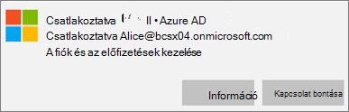
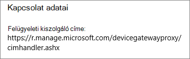
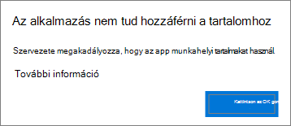
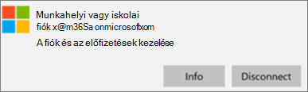
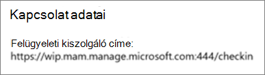

# Appvédelmi beállítások érvényességének ellenőrzése Windows 10-es PC-kenValidate app protection settings on Windows 10 PCs

## Meggyőződés arról, hogy a felhasználók nem tudnak céges adatokat másolni a vállalati eszközökön megtalálható személyes fájlokbaVerify that users cannot copy company data to personal files on corporate devices

Miután [beállította az appvédelmi házirendeket](protection-settings-for-windows-10-devices.md), néhány óra is eltelhet, amíg a szabályzatok érvénybe lépnek a felhasználók eszközein.After you [set up app protection policies](protection-settings-for-windows-10-devices.md), it may take up to a few hours for the policy to take effect on users' devices. Ha bekapcsolta **a** **Vállalati adatok személyes fájlokba másolásának megakadályozása beállítást, és arra kényszeríti őket, hogy munkahelyi fájlokat mentsenek** a OneDrive Vállalati verzióba vállalati tulajdonú eszközökhöz, ezt ellenőrizheti a felhasználó eszközén, miután csatlakoztak az Azure AD-hez, és bejelentkeztek.If you turned **On** the **Prevent users from copying company data to personal files and force them to save work files to OneDrive for Business** setting for company owned devices, you can check this on the user's device after they've connected to Azure AD and signed in. 
  
 **A kapcsolat beállításainak ellenőrzése****Verify connection settings**
  
1. After you sign in with Microsoft 365 Business credentials and connect to Azure AD as described in [Set up Windows devices for Microsoft 365 Business users](set-up-windows-devices.md), go to **Windows Settings** \> **Accounts** \> **Access work or school**. Choose **Connected to \<tenant name\> Azure AD**, and then choose **Info**.After you sign in with Microsoft 365 Business credentials and connect to Azure AD as described in [Set up Windows devices for Microsoft 365 Business users](set-up-windows-devices.md), go to **Windows Settings** \> **Accounts** \> **Access work or school**. Choose **Connected to \<tenant name\> Azure AD**, and then choose **Info**.
    
    
  
2. A **Bérlő által** \<\> kezelt név lapon láthatja a **Kapcsolat adatait,** amely az alábbi ábrán láthatóhoz hasonló **felügyeleti kiszolgálócímet** tartalmaz.On the **Managed by** \<tenant name\> page, you can see the **Connection info** that includes a **Management Server Address** like the one shown in the following figure. 
    
    
  
 **Annak ellenőrzése, hogy nem tud-e vállalati adatokat beilleszteni egy nem felügyelt alkalmazásban****Verify that you cannot paste company data in a non-managed app**
  
1. Nyissa meg a Microsoft 365 Business által telepített Outlook 2016-ot.Open Outlook 2016 that was installed by Microsoft 365 Business.
    
2. Nyisson meg egy e-mailt, és másoljon belőle tartalmat a vágólapra.Open an email and copy some content from it.
    
    Nyissa meg a Jegyzettömböt, és kísérelje meg beilleszteni a vágólapra másolt tartalmat.Open Notepad and attempt to paste the content in.
    
    Hibaüzenet jelenik meg, amely szerint az alkalmazás nem tud hozzáférni a tartalomhoz.You'll receive an error that states the app can't access content.
    
    
  
    A Word 2016-ba azonban beillesztheti a szóban forgó tartalmat.You can, however, paste the same content into Word 2016.
    
## Meggyőződés arról, hogy a felhasználók nem tudnak céges adatokat másolni a személyes eszközökön megtalálható személyes fájlokbaVerify that users cannot copy company data to personal files on personal devices

 **A kapcsolat beállításainak ellenőrzése****Verify connection settings**
  
1. A Windows 10-es személyes eszközén, ahol helyi felhasználóként van bejelentkezve, nyissa meg a **Windows-beállítások**lapot, és koppintson vagy koppintson vagy koppintson a **Fiókok** \> **elérése munkahelyi vagy iskolai elemre.**On your Windows 10 personal device where you're logged in as a local user, go to **Windows Settings**, and click or tap **Accounts** \> **Access work or school**.
    
2. A **Hozzáférés munkahelyi vagy iskolai rendszerhez** csoportban válassza a **Csatlakozás** elemet.Under the **Access work or school**, choose **Connect**.
    
3. Írja be a Microsoft 365 Business hitelesítő adatait a **Munkahelyi vagy iskolai fiók beállítása** \> **Bejelentkezés** lehetőséget választva.Enter your Microsoft 365 Business credential into the **Set up a work or school account dialog** \> **Sign in**.
    
4. A **Munkahelyi vagy iskolai hozzáférés** lapon válassza a **Munkahelyi vagy iskolai fiók** lehetőséget, majd az **Információ** elemet.On the **Access work or school** page, choose the **Work or school account**, and then choose **Info**.
    
    
  
5. Az **Access munka vagy iskola** lapon megtekintheti a **Kapcsolat adatait,** amely az alábbi ábrán láthatóhoz hasonló **felügyeleti kiszolgálócímet** tartalmaz, és tartalmazza a *wip* és *a mam* szavakat.On the **Access work or school** page, you can see the **Connection info** that includes a **Management Server Address** like the one shown in the following figure, and includes the words  *wip*  and  *mam*  within. 
    
    
  
 **Annak ellenőrzése, hogy nem tud-e vállalati adatokat beilleszteni egy nem felügyelt alkalmazásban****Verify that you cannot paste company data in a non-managed app**
  
1. Nyissa meg az Outlook 2016-ot, szükség esetén vegye fel Microsoft 365 Business-fiókját, és jelentkezzen be a Microsoft 365 Business hitelesítő adataival.Open Outlook 2016 and add your Microsoft 365 Business account if necessary and sign in with your Microsoft 365 Business credentials.
    
2. Nyisson meg egy e-mailt, és másoljon belőle tartalmat a vágólapra.Open an email and copy some content from it.
    
    Nyissa meg a Jegyzettömböt, és kísérelje meg beilleszteni a vágólapra másolt tartalmat.Open Notepad and attempt to paste the content in.
    
    Hibaüzenet jelenik meg, amely szerint az Alkalmazás nem fér hozzá a tartalomhoz.You'll receive an error that states App can't access content.
    
    
  
    A Word 2016-ba azonban beillesztheti a szóban forgó tartalmat.You can, however, paste the same content into Word 2016.
    

