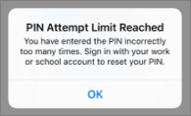

# Alkalmazásvédelmi beállítások ellenőrzése Android- vagy iOS-eszközökön

Kövesse az alábbi szakaszokban található utasításokat az alkalmazásvédelmi beállítások érvényesítéséhez Android vagy iOS rendszerű eszközökön.
  
## Android
  
### Annak ellenőrzése, hogy az alkalmazásvédelmi beállítások működnek-e a felhasználói eszközökön

Miután [konfigurálta az Android-eszközök beállításait](app-protection-settings-for-android-and-ios.md) az appok védelmére, az alábbi lépésekkel ellenőrizheti, hogy működnek-e a kiválasztott beállítások. 
  
Először győződjön meg arról, hogy a szabályzat vonatkozik arra az alkalmazásra, amelyben ellenőrizni fogja.
  
1. A Microsoft 365 Vállalati prémium [verzió felügyeleti központjában](https://portal.office.com)nyissa meg a **Policies** \> **Házirendek szerkesztési házirendcímű verziót.**
    
2. Válassza **az Android alkalmazásházirendjét** a beállításkor létrehozott beállításokhoz, vagy egy másik, ön által létrehozott házirendet, és ellenőrizze, hogy az outlookban van-e érvényben. 
    
    
  
### A „PIN-kód vagy ujjlenyomat megkövetelése az Office-appok eléréséhez" beállítás ellenőrzése

A **Házirend szerkesztése** ablaktáblában válassza a **Szerkesztés** elemet az **Office-dokumentumok elérésének szabályozása** elem mellett, bontsa ki az **Office-fájlok felhasználói mobileszközökön történő elérésének felügyelete** csomópontot, és győződjön meg arról, hogy a **PIN-kód vagy ujjlenyomat megkövetelése az Office-appok eléréséhez** beállítás értéke **Be**.
  

  
1. A felhasználó Android-eszközén nyissa meg az Outlookot, és jelentkezzen be a felhasználó Microsoft 365 Business Premium hitelesítő adataival.
    
2. A rendszer pin-kódot is kérni fog, vagy ujjlenyomatot kell használnia.
    
    
  
### A „PIN-kód alaphelyzetbe állítása ennyi sikertelen kísérlet után" beállítás ellenőrzése

A **Házirend szerkesztése** ablaktáblán válassza a **Szerkesztés lehetőséget** az **Office-dokumentumok hozzáférés-vezérlése**mellett, válassza **a Felhasználók hozzáférésének kezelése mobileszközökön**lehetőséget, és győződjön meg arról, hogy **a PIN-kód visszaállítása a sikertelen kísérletek száma után** bizonyos számra van állítva. Ez alapértelmezés szerint 5. 
  
1. A felhasználó Android-eszközén nyissa meg az Outlookot, és jelentkezzen be a felhasználó Microsoft 365 Business Premium hitelesítő adataival.
    
2. Írjon be egy helytelen PIN-kódot a házirendben megadott alkalommal. Megjelenik egy kérdés, amely kimondja, hogy a **PIN-kód ra vonatkozóan elérte** a PIN-kód visszaállításához elért PIN-kódkorlátot. 
    
    
  
3. Válassza a **PIN-kód visszaállítása** elemet. A rendszer kéri, hogy jelentkezzen be a felhasználó Microsoft 365 Business Premium hitelesítő adataival, majd új PIN-kódot kell beállítania.
    
### „A felhasználók kényszerítése arra, hogy az összes munkahelyi fájljukat ide mentsék: OneDrive Vállalati verzió" beállítás ellenőrzése

A **Házirend szerkesztése** ablaktáblában válassza a **Szerkesztés** elemet az **Elveszett vagy ellopott eszközök elleni védelem** elem mellett, bontsa ki a **Munkahelyi fájlok védelme az eszköz elvesztése vagy ellopása esetén** csomópontot, és győződjön meg arról, hogy **A felhasználók kényszerítése arra, hogy az összes munkahelyi fájljukat ide mentsék: OneDrive Vállalati verzió** beállítás értéke **Be**.
  

  
1. A felhasználó Android-eszközén nyissa meg az Outlookot, jelentkezzen be a felhasználó Microsoft 365 Business Premium hitelesítő adataival, és szükség esetén adjon meg PIN-kódot.
    
2. Nyisson meg egy mellékletet tartalmazó e-mailt, és koppintson a lefelé mutató nyíl ikonra a melléklet adatai mellett.
    
    
  
    A nem **menthető eszközre** a képernyő alján látható. 
    
    
  
    > [!NOTE]
    > A OneDrive Vállalati verzióba való mentés jelenleg nem engedélyezett az Android rendszerben, így csak annyi látható, hogy a helyi mentés le van tiltva. 
  
### „A felhasználónak ismét be kell jelentkeznie az Office-appok ennyi ideig tartó üresjárata után" beállítás ellenőrzése

A **Házirend szerkesztése** ablaktáblán válassza a **Szerkesztés lehetőséget** az **Office-dokumentumok hozzáférés-vezérlése**mellett, válassza **a Felhasználók hozzáférésének kezelése mobileszközökön**lehetőséget, és győződjön meg arról, hogy **A felhasználók bejelentkezésének megkövetelése az Office-alkalmazások tétlensége után** bizonyos számú percre van beállítva. Ez alapértelmezés szerint 30 perc. 
  
1. A felhasználó Android-eszközén nyissa meg az Outlookot, jelentkezzen be a felhasználó Microsoft 365 Business Premium hitelesítő adataival, és szükség esetén adjon meg PIN-kódot.
    
2. Ekkor megjelenik az Outlook Beérkezett üzenetek mappája. Hagyja az Android-eszközt üresjáratban legalább 30 percig (vagy más időtartamig, az a lényeg, hogy hosszabb legyen a házirendben meghatározottnál). Az eszköz valószínűleg elsötétül.
    
3. Az Outlook ismételt elérése Android-eszközön.
    
4. Az Outlook ismételt elérése előtt meg kell adnia a PIN-kódját.
    
### A „Munkahelyi fájlok védelme titkosítással" beállítás ellenőrzése

A **Házirend szerkesztése** ablaktáblában válassza a **Szerkesztés** elemet az **Elveszett vagy ellopott eszközök elleni védelem** elem mellett, bontsa ki a **Munkahelyi fájlok védelme az eszköz elvesztése vagy ellopása esetén** csomópontot, és győződjön meg arról, hogy a **Munkahelyi fájlok védelme titkosítással** beállítás értéke **Be**, **A felhasználók kényszerítése arra, hogy az összes munkahelyi fájljukat ide mentsék: OneDrive Vállalati verzió** beállításé pedig **Ki**.
  
1. A felhasználó Android-eszközén nyissa meg az Outlookot, jelentkezzen be a felhasználó Microsoft 365 Business Premium hitelesítő adataival, és szükség esetén adjon meg PIN-kódot.
    
2. Nyisson meg egy e-mailt, amely néhány képfájl-mellékletet tartalmaz.
    
3. Koppintson a lefelé mutató nyílra a melléklet adatai mellett a mentéséhez.
    
    
  
4. Ekkor a rendszer arra kérheti, hogy engedélyezze a hozzáférést az Outlooknak a fényképekhez, médiatartalmakhoz és más fájlokhoz. Koppintson az **Engedélyezés** gombra.
    
5. A képernyő alján válassza a **Mentés helye: Eszköz** lehetőséget, majd nyissa meg a **Galéria** appot. 
    
6. A listában látható lehet egy (vagy - ha több, képfájlt tartalmazó mellékletet mentett - több) titkosított fájl. Egy szürke négyzetként jelenhet meg a Képek listában, amelyben középen egy fehér felkiáltójel látható egy fehér körön belül.
    
    
  
## Ios
  
### Az appkezelési beállítások működésének ellenőrzése a felhasználói eszközökön

Miután [konfigurálta az iOS-eszközök beállításait](app-protection-settings-for-android-and-ios.md) az appok védelmére, az alábbi lépésekkel ellenőrizheti, hogy működnek-e a kiválasztott beállítások. 
  
Először győződjön meg arról, hogy a szabályzat vonatkozik arra az alkalmazásra, amelyben ellenőrizni fogja.
  
1. A Microsoft 365 Vállalati prémium [verzió felügyeleti központjában](https://portal.office.com)nyissa meg a **Policies** \> **Házirendek szerkesztési házirendcímű verziót.**
    
2. Válassza **az iOS alkalmazásházirendet** a telepítéskor létrehozott beállításokhoz, vagy egy másik, ön által létrehozott házirendet, és ellenőrizze, hogy az outlookhoz van-e kényszerítve. 
    
    
  
### A „PIN-kód vagy ujjlenyomat megkövetelése az Office-appok eléréséhez" beállítás ellenőrzése

A **Házirend szerkesztése** ablaktáblában válassza a **Szerkesztés** elemet az **Office-dokumentumok elérésének szabályozása** elem mellett, bontsa ki az **Office-fájlok felhasználói mobileszközökön történő elérésének felügyelete** csomópontot, és győződjön meg arról, hogy a **PIN-kód vagy ujjlenyomat megkövetelése az Office-appok eléréséhez** beállítás értéke **Be**.
  

  
1. A felhasználó iOS-készülékén nyissa meg az Outlookot, és jelentkezzen be a felhasználó Microsoft 365 Business Premium hitelesítő adataival.
    
2. A rendszer pin-kódot is kérni fog, vagy ujjlenyomatot kell használnia.
    
    
  
### A „PIN-kód alaphelyzetbe állítása ennyi sikertelen kísérlet után" beállítás ellenőrzése

A **Házirend szerkesztése** ablaktáblán válassza a **Szerkesztés lehetőséget** az **Office-dokumentumok hozzáférés-vezérlése**mellett, válassza **a Felhasználók hozzáférésének kezelése mobileszközökön**lehetőséget, és győződjön meg arról, hogy **a PIN-kód visszaállítása a sikertelen kísérletek száma után** bizonyos számra van állítva. Ez alapértelmezés szerint 5. 
  
1. A felhasználó iOS-készülékén nyissa meg az Outlookot, és jelentkezzen be a felhasználó Microsoft 365 Business Premium hitelesítő adataival.
    
2. Írjon be egy helytelen PIN-kódot a házirendben megadott alkalommal. Megjelenik egy kérdés, amely kimondja, hogy a **PIN-kód ra vonatkozóan elérte** a PIN-kód visszaállításához elért PIN-kódkorlátot. 
    
    
  
3. Válassza az **OK** gombot. A rendszer kéri, hogy jelentkezzen be a felhasználó Microsoft 365 Business Premium hitelesítő adataival, majd új PIN-kódot kell beállítania.
    
### „A felhasználók kényszerítése arra, hogy az összes munkahelyi fájljukat ide mentsék: OneDrive Vállalati verzió" beállítás ellenőrzése

A **Házirend szerkesztése** ablaktáblában válassza a **Szerkesztés** elemet az **Elveszett vagy ellopott eszközök elleni védelem** elem mellett, bontsa ki a **Munkahelyi fájlok védelme az eszköz elvesztése vagy ellopása esetén** csomópontot, és győződjön meg arról, hogy **A felhasználók kényszerítése arra, hogy az összes munkahelyi fájljukat ide mentsék: OneDrive Vállalati verzió** beállítás értéke **Be**.
  

  
1. A felhasználó iOS-készülékén nyissa meg az Outlookot, jelentkezzen be a felhasználó Microsoft 365 Business Premium hitelesítő adataival, és szükség esetén adjon meg PIN-kódot.
    
2. Nyisson meg egy mellékletet tartalmazó e-mailt, nyissa meg a mellékletet, és válassza a **Mentés** elemet a képernyő alján. 
    
    
  
3. Elvileg csak a OneDrive Vállalati verzió beállítás látható. Ha nem, koppintson a **Fiók hozzáadása** elemre, és válassza a **OneDrive Vállalati** verzió lehetőséget a **Tárfiók hozzáadása** képernyőn. Adja meg a végfelhasználó Microsoft 365 Business Premium szolgáltatását, hogy amikor a rendszer kéri, jelentkezzen be. 
    
    Koppintson a **Mentés** elemre, és válassza a **OneDrive Vállalati verzió** lehetőséget.
    
### „A felhasználónak ismét be kell jelentkeznie az Office-appok ennyi ideig tartó üresjárata után" beállítás ellenőrzése

A **Házirend szerkesztése** ablaktáblán válassza a **Szerkesztés lehetőséget** az **Office-dokumentumok hozzáférés-vezérlése**mellett, válassza **a Felhasználók hozzáférésének kezelése mobileszközökön**lehetőséget, és győződjön meg arról, hogy **A felhasználók bejelentkezésének megkövetelése az Office-alkalmazások tétlensége után** bizonyos számú percre van beállítva. Ez alapértelmezés szerint 30 perc. 
  
1. A felhasználó iOS-készülékén nyissa meg az Outlookot, jelentkezzen be a felhasználó Microsoft 365 Business Premium hitelesítő adataival, és szükség esetén adjon meg PIN-kódot.
    
2. Ekkor megjelenik az Outlook Beérkezett üzenetek mappája. Hagyja az iOS-eszközt érintetlenül legalább 30 percig (vagy más időtartamig, az a lényeg, hogy hosszabb legyen a házirendben meghatározottnál). Az eszköz valószínűleg elsötétül.
    
3. Ismét elérheti az Outlookot az iOS-eszközön.
    
4. Az Outlook ismételt elérése előtt meg kell adnia a PIN-kódját.
    
### A „Munkahelyi fájlok védelme titkosítással" beállítás ellenőrzése

A **Házirend szerkesztése** ablaktáblában válassza a **Szerkesztés** elemet az **Elveszett vagy ellopott eszközök elleni védelem** elem mellett, bontsa ki a **Munkahelyi fájlok védelme az eszköz elvesztése vagy ellopása esetén** csomópontot, és győződjön meg arról, hogy a **Munkahelyi fájlok védelme titkosítással** beállítás értéke **Be**, **A felhasználók kényszerítése arra, hogy az összes munkahelyi fájljukat ide mentsék: OneDrive Vállalati verzió** beállításé pedig **Ki**.
  
1. A felhasználó iOS-készülékén nyissa meg az Outlookot, jelentkezzen be a felhasználó Microsoft 365 Business Premium hitelesítő adataival, és szükség esetén adjon meg PIN-kódot.
    
2. Nyisson meg egy e-mailt, amely néhány képfájl-mellékletet tartalmaz.
    
3. Koppintson a mellékletre, majd alatta a **Mentés** elemre. 
    
4. Nyissa meg a **Fotók** appot a kezdőképernyőről. Ekkor egy (vagy - ha több, képfájlt tartalmazó mellékletet mentett - több) mentett, ám titkosított fényképet kell látnia. 
    
---

