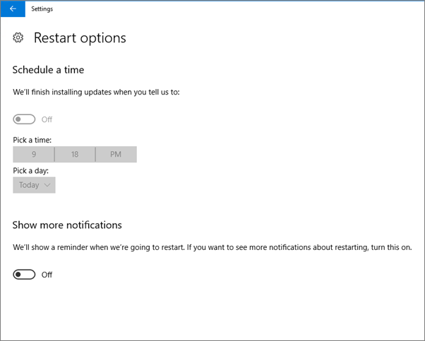
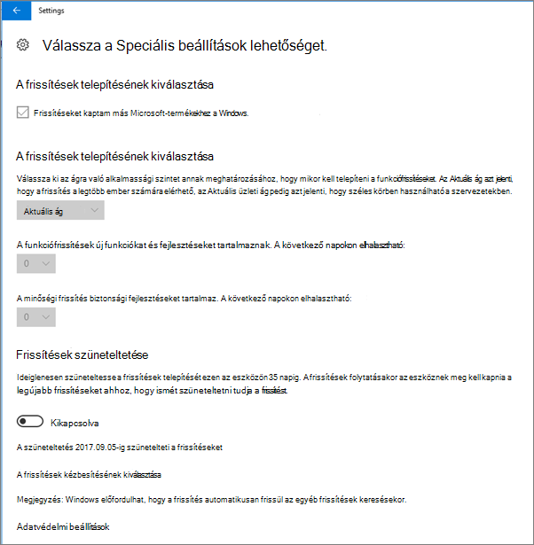
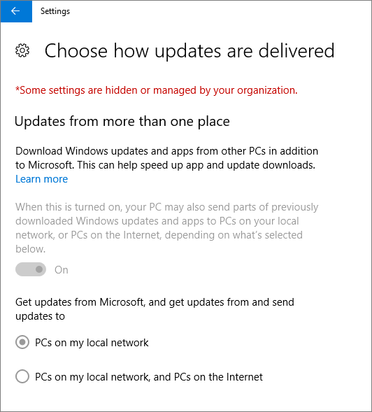
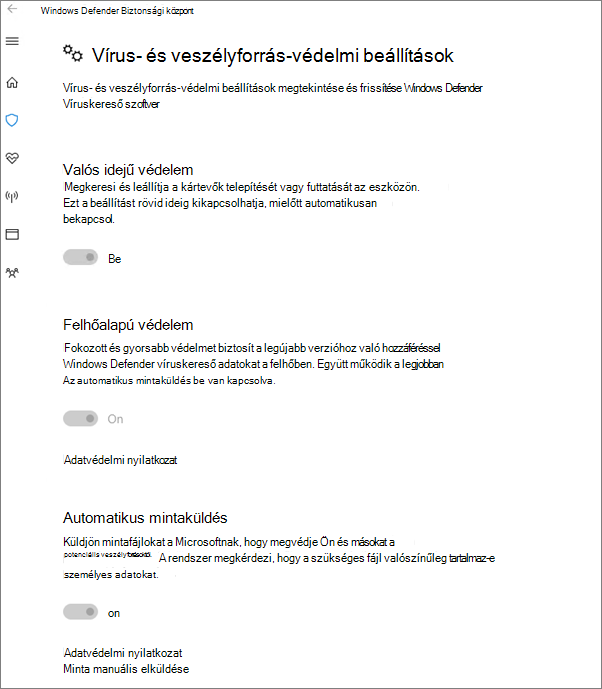

# Eszközvédelmi beállítások érvényességének ellenőrzése Windows 10-es PC-kenValidate device protection settings on Windows 10 PCs

## Windows 10-eszközházirendek érvénybe lépésének ellenőrzéseVerify that Windows 10 device policies are set

Miután [beállította az eszközházirendeket](protection-settings-for-windows-10-pcs.md), néhány óra is eltelhet, amíg a házirendek érvénybe lépnek a felhasználók eszközein.After you [set up devices policies](protection-settings-for-windows-10-pcs.md), it may take up to a few hours for the policy to take effect on users' devices. A házirendek érvénybe lépéséről úgy bizonyosodhat meg, ha ellenőrzi a felhasználók eszközein a Windows Gépház bizonyos beállításlapjait.You can confirm that the policies took effect by looking at various Windows Settings screens on the users' devices. Mivel a felhasználók nem tudják módosítani a Windows Update és a Windows Defender víruskereső beállításait a Windows 10-es eszközeiken, számos lehetőség szürkén jelenik meg.Because the users won't be able to modify the Windows Update and Windows Defender Antivirus settings on their Windows 10 devices, many options will be grayed out.
  
1. Nyissa meg a **Beállítások** \> **frissítése &amp; biztonsági** \> **Windows Update** \> Újraindítás **beállításait,** és ellenőrizze, hogy az összes beállítás szürkén jelenik-e meg.Go to **Settings** \> **Update &amp; security** \> **Windows Update** \> **Restart options** and confirm that all settings are grayed out. 
    
    
  
2. Nyissa meg a **Beállítások** \> **frissítése &amp; biztonsági** \> **Windows Update** \> Speciális **beállításokat,** és ellenőrizze, hogy az összes beállítás szürkén jelenik-e meg.Go to **Settings** \> **Update &amp; security** \> **Windows Update** \> **Advanced options** and confirm that all settings are grayed out. 
    
    
  
3. Go to **Settings** \> **Update &amp; security** \> **Windows Update** \> **Advanced options** \> **Choose how updates are delivered**.Go to **Settings** \> **Update &amp; security** \> **Windows Update** \> **Advanced options** \> **Choose how updates are delivered**.
    
    Ellenőrizze, hogy látható-e az üzenet (pirossal) arról, hogy egyes beállítások rejtve vannak vagy a szervezet által kezeltek, és az összes beállítás szürkén jelenik meg.Confirm that you can see the message (in red) that some settings are hidden or managed by your organization, and all the options are grayed out.
    
    
  
4. To open the Windows Defender Security Center, go to **Settings** \> **Update &amp; security** \> **Windows Defender** \> click **Open Windows Defender Security Center** \> **Virus &amp; thread protection** \> **Virus &amp; threat protection settings**.To open the Windows Defender Security Center, go to **Settings** \> **Update &amp; security** \> **Windows Defender** \> click **Open Windows Defender Security Center** \> **Virus &amp; thread protection** \> **Virus &amp; threat protection settings**. 
    
5. Ellenőrizze, hogy minden beállítás szürkén jelenik-e meg.Verify that all options are grayed out. 
    
    
  
## Kapcsolódó témakörökRelated Topics

[A Microsoft 365 Business dokumentációja és forrásaiMicrosoft 365 Business documentation and resources](https://go.microsoft.com/fwlink/p/?linkid=853701)
  
[A Microsoft 365 Business használatbavételeGet started with Microsoft 365 Business](microsoft-365-business-overview.md)
  
[A Microsoft 365 Business kezeléseManage Microsoft 365 Business](manage.md)
  
[Eszközkonfigurációk megadása Windows 10-es PC-kenSet device configurations for Windows 10 PCs](protection-settings-for-windows-10-pcs.md)
  

