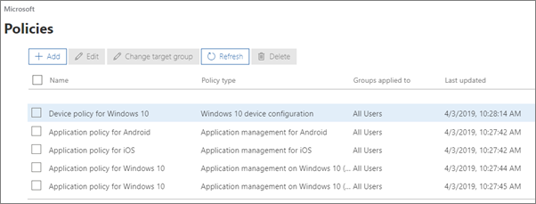
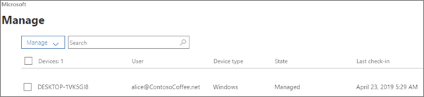

# Házirendek és eszközök megtekintése és kezelése

Ez a cikk a Microsoft 365 Vállalati prémium verzióra vonatkozik.

## Eszköz házirendek megtekintése és szerkesztése

1.  A felügyeleti központ megnyitásához: <a href="https://go.microsoft.com/fwlink/p/?linkid=837890" target="_blank">https://admin.microsoft.com</a> .
2. A bal oldali  navigációs sávon válassza az Eszköz \> **házirendek lehetőséget.**

    Ezen a lapon házirendet hozhat létre, szerkeszthet, módosíthat célcsoportokat, illetve törölhet házirendeket.

    
  
## Eszközök megtekintése és kezelése

1. A bal oldali navigációs sávon válassza az **Eszközök** \> **kezelése lehetőséget.** 
    
    Ezen a lapon kijelölhet egy vagy több eszközt, és eltávolíthatja a céges adatokat. Olyan Windows 10-es eszköz esetében, amelyhez eszközvédelmi beállításokat adott meg, az eszköz gyári állapotát is visszaállíthatja itt.
  
   

